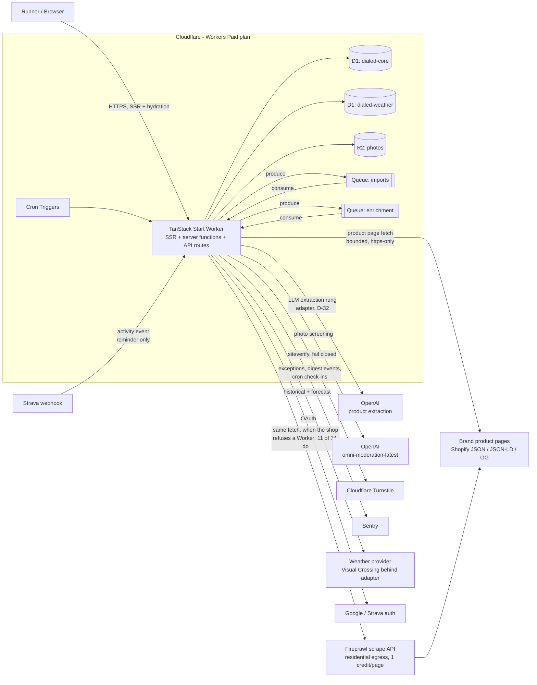
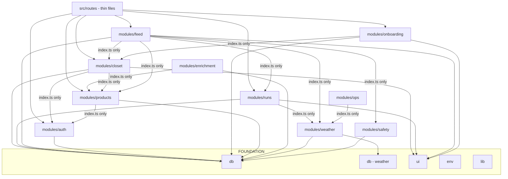
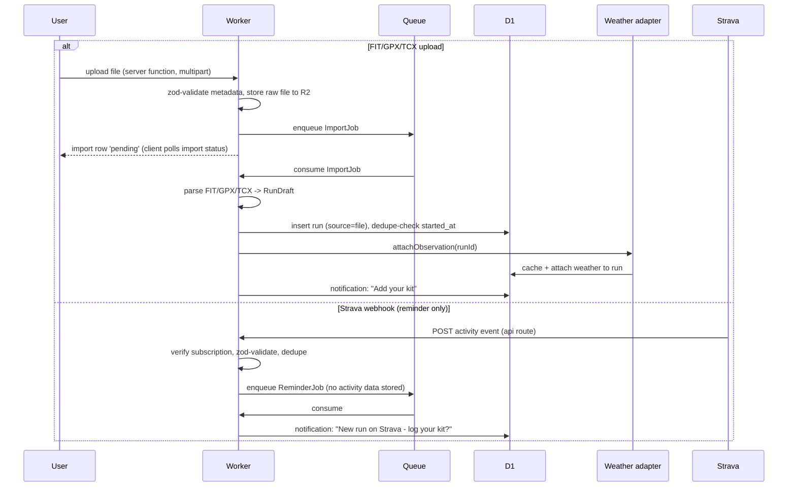
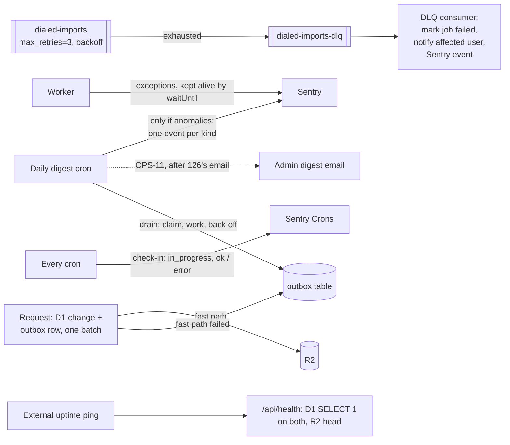

# dialed.run — Architecture

One Worker, SSR-first, everything on the Cloudflare $5 plan. This document is
the shared map: humans review against it, agents build against it. **If your
change alters a boundary shown here, update the diagram in the same PR.**

Supersedes `plan/docs/architecture.md` (htmx/Hono replaced by TanStack Start;
same backend shape).

## System context



Key decisions embedded here:

- **Strava data never enters the feed or the recommender.** The webhook is a
  reminder trigger only; run records are first-party (manual or file import).
- **Two D1 databases**: `dialed-core` (users, closet, runs, feed) and
  `dialed-weather` (observations cache). Weather grows unbounded; isolating
  it protects the core DB from the 10 GB per-database cap.
- **One rule decides public visibility** (106). `modules/safety` owns
  `publiclyVisibleEntry()`, and `modules/feed` imports it rather than
  writing `is_public = 1` at each of its five read sites. The arrow
  therefore runs feed → safety, not the reverse: safety knows about entries,
  and nothing in safety imports feed.
- **A photo has a second gate, and it is a different question** (106). The
  entry rule answers "may this post be seen"; `isPhotoPubliclyVisible()`
  answers "has this image been screened", and a photo needs both. They are
  separate because a screening verdict is not a moderation decision: a
  runner's public post can carry a photo the classifier has not passed, and
  the post stays while the photo does not. Three reads consult it — the
  photo route, entry detail and the feed list — and for a while none did,
  which meant `screen_status` was written by four paths and read by none.
- **Photo screening calls out to OpenAI's moderation endpoint**, not to
  Workers AI — the catalogue has one image classifier (`resnet-50`,
  ImageNet classes) and no content-safety model. It is a secret, so no new
  binding; the retry is the `screening-retry` cron reconciling rows still
  marked `pending`, because that marker already exists (law 8c) and a queue
  would be the over-engineered version.
- **Weather is an adapter** (`modules/weather/provider/`). Visual Crossing is
  the first implementation; swapping providers is a one-directory change.
  (The design artboards label the forecast "NWS" — that's a design delta, not
  a decision; see `docs/design-deltas.md`.) Weather also reads/writes
  `runs.weather_status` in `dialed-core` directly (the only column it
  touches there) since that status lives on the run, not the cache; other
  modules reach cached conditions only through weather's `index.ts` reads.
  The hourly retry cron is dispatched from `modules/ops/scheduled.ts`.

  **Its attribution line is not in the module** (moved by task 115).
  `WeatherAttribution` is an anchor and a sentence, imports nothing from
  weather, and Visual Crossing's free tier requires it _wherever
  conditions are shown_ — a rule about every screen, which is what `ui/`
  is for. It had to move rather than merely wanting to: reaching it meant
  importing the weather **barrel**, which exports `attachObservation`,
  which reaches `src/env`, which is a bare re-export of
  `cloudflare:workers`. Rolldown cannot strip a module-scope import it
  must keep, so one attribution line in a client component broke
  `npm run build` outright. Deep-importing past the barrel is not the
  alternative — dependency-cruiser forbids it. So the weather barrel's
  public API is now three entries, not four.

## Frontend architecture (TanStack Start)

- **SSR-first**: every page renders on the Worker; hydration gives the
  app-like interactions the design needs (picker sheets, multi-select,
  transitions) without a separate SPA or API layer.
- **Server functions are the API.** Mutations and loads are typed server
  functions in modules, invoked from loaders/components — no hand-rolled JSON
  endpoints except `src/routes/api/` for machine callers (Strava webhook,
  health checks), which parse with zod like any trust boundary.
- **Route ownership = directory ownership** (see contracts). Route files are
  thin; modules hold logic and components.
- **View layer**: five-tab shell (`ui/Layout`): Feed · Closet · +Add · Call
  (teaser until the call epic) · You. Mobile-first for logging, desktop-first
  for the closet — both responsive, no separate builds.
- **Navigation is typed at the edge, not at the screen** (design round 12,
  task 117). `src/lib/nav-types.ts` holds the `NAV` table and answers
  `(from, to, isBack)` with the view-transition types the browser gets;
  `src/router.tsx` passes that function to `defaultViewTransition` and holds
  no logic, because nothing can import it (`routeTree.gen` pulls every route,
  a route pulls server functions). No component knows a navigation type, and
  `cut` is spelled `false`, which skips the transition rather than running an
  empty one. `src/ui/motion.css` says what each type looks like.
- **Offline is deliberately out of scope for v1** (decision D-07). Nothing may
  preclude a later service-worker/PWA layer: no reliance on in-memory session
  state across navigations, all mutations idempotent where the contract allows.

  Two module-scope records do survive client-side navigation — `FlowStep`'s
  last step and `TabBar`'s last tab — and they are inside this rule rather
  than exceptions to it. Both are written only from an effect, so the server
  never sees one; both carry presentation and never correctness; and both
  degrade to their SSR answer (no move, no tab lit) on a cold load, which is
  what a service worker would serve. Nothing reads them to decide what to
  write.

## Module dependency graph (enforced by dependency-cruiser)



Rules: modules import foundation freely; cross-module imports go through the
target module's `index.ts`; only `env/` reads bindings; route files import
modules but are imported by nothing; no cycles.

Lane 101 added `CLOSET/PROD -->|index.ts only| AUTH`: every `closet.*` /
`products.*` server function scopes its query to the signed-in user, which
means checking the session itself (server functions are directly callable —
a route-level check alone isn't a security boundary). Both modules import
only `auth`'s `index.ts` (the Better Auth instance), the same surface
`modules/auth/functions.ts` itself uses.

## Authentication

Asked during the PR #4 review and not written down anywhere, which is how a
mechanism that is obvious to whoever wired it becomes invisible afterwards.

**Cookie sessions, not stateless JWTs.** Better Auth with the
`tanstackStartCookies()` plugin: a session row in `DIALED_CORE` keyed by an
opaque token in an HttpOnly cookie. Sessions being rows means revocation is
real — delete the row — rather than waiting out a token's expiry.

**One mechanism for both surfaces.** A route loader and a server function are
both just requests carrying that cookie, and server functions are RPC to the
same origin, so the cookie rides along with no extra work. That is why a
single session lookup serves the UI and the "API" — there is no second
credential and no bearer-token path.

Four entry points, all in `modules/auth`, differing only in what they do when
there is no session:

| call                          | for                                 | on no session                  |
| ----------------------------- | ----------------------------------- | ------------------------------ |
| `requireUserId()`             | server functions                    | throws `AuthRequiredError`     |
| `requireSession()`            | route loaders                       | redirects to `/auth/login`     |
| `sessionFromRequest(request)` | raw `server.handlers` routes        | returns `null`, caller decides |
| `getSession()`                | anything rendering signed-out state | returns `null`                 |

`sessionFromRequest` exists because a raw handler has a `Request` rather than
TanStack's server context, so it cannot read headers the way the other two do.

**Detect the unauthenticated case with `isAuthRequired(error)`, never
`instanceof`.** A server function's rejection is structured-cloned across the
RPC boundary and arrives without its prototype, so `instanceof` returns false
in exactly the place the answer matters. The guard checks a `code` property,
which survives the trip.

An eslint rule rejects a module-local `requireUserId` or a direct
`auth.api.getSession` outside `modules/auth`. Four hand-written copies had
already become three incompatible error types before that rule existed, which
left no caller able to tell "session expired, sign in again" from "something
broke".

## Import pipeline (lane 102)



Manual entry is a plain server function: parse `RunDraft`, insert, attach
weather inline (degrade to `weather_pending` on failure — law 5).

## Product enrichment pipeline (lane 107)

Pasted product URL → server function validates https + resolves/creates the
product row (garment saves immediately, never blocked) → enqueue EnrichJob on
`dialed-enrichment`. Consumer: bounded fetch of the page (10s timeout, 6 MB
cap, https only, no private address space) — direct from the Worker first,
and through Firecrawl's proxy when the shop refuses a Worker, which 11 of 14
sampled retailers do (`FIRECRAWL_API_KEY`; absent, the refusal is a failed
fetch and nothing more) → snapshot raw HTML to R2 →
extraction ladder: JSON-LD Product schema → Shopify `/products/<handle>.json`
→ OG tags → LLM rung (page text → `extractedProductSchema` via the
`ExtractionModel` adapter). Best data wins per field; typed columns get the
recommender-relevant core, `extracted` JSON keeps the rest and the
precedence ledger, primary image is copied to R2. Failures mark
`extraction_status='failed'` and never surface as user errors — user-entered
fields are always the floor (law 5). Extraction is idempotent (a redelivery
reuses a snapshot fetched inside the last hour) and re-runnable over stored
snapshots (D-31). The enqueue is reconciliation, not a transaction: the row
goes `pending` first, the send is a fast path, and the `enrichment-retry`
cron (`30 * * * *`) re-dispatches anything still pending after fifteen
minutes.

## Feed read paths (lane 104)

**Following feed** — fanout-on-read, one indexed query: public
`outfit_entries` joined to `follows` on author (plus self), ordered by
`created_at DESC`, cursor-paginated (created_at + id). Covering indexes:
`follows(follower_id, followee_id)` and
`outfit_entries(user_id, created_at DESC)`. No feed table, no write
amplification. Photos are not public bucket URLs: every photo is served by the Worker
(`routes/feed/photo.$.tsx`), which checks visibility and screening before it
reads R2. Task 128 (SAF-7) moves public-entry photos to short-lived signed
URLs, cacheable for their TTL (decision D-46).

**Your conditions (E2-lite)** — the consensus block only in v1: recent public
entries (last 72h, `outfit_entries(is_public, created_at DESC)` index) whose
runs' observations fall within a proximity window of the viewer's current
conditions (±3°C on feels-like, same precip class), aggregated to
per-UI-group wear counts ("15/18 wore long sleeve"). Bounded scan window +
in-Worker aggregation is fine at launch scale; the packet requires EXPLAIN
output and a row-scan cap. Manual-source observations are excluded. Stranger
cards and follow CTAs are the full-E2 epic, post-MVP.

## Composing across modules

One module needs a control another module owns. Feed's entry detail needs
W1's report button; the button opens a sheet with a reason list, its own
copy, and a server function behind it, and all of that belongs to
`modules/safety`.

**Feed may not import it, and the rule is load-bearing rather than tidy.**
`modules/safety`'s barrel reaches D1, and `EntryDetail` is in the client
bundle — so the import would put the drizzle schema in the browser, which
tsc, eslint, dependency-cruiser and the test suite are all blind to (see
§Module dependency graph, and CLAUDE.md for the two times it happened).

**The seam is a `ReactNode` prop, composed by the route.**

```
routes/feed/entry.$entryId.tsx     imports BOTH modules — it is a route,
  │                                 it is not in the client bundle's
  │                                 import graph the same way, and wiring
  │                                 is the only thing it is allowed to do
  ├── modules/safety   → <ReportAffordance … />
  └── modules/feed     → <EntryDetail reportAffordance={…} />
                              │
                              └── renders the node. Does not know what a
                                  report is, cannot reach D1, stays
                                  testable in the ui project.
```

**Not a callback.** The thing feed must not import is not the _function_ —
it is the sheet and its copy, which a callback would still have to render
from inside feed. A node moves the whole subtree across; a callback moves
only the verb.

Raised as a question on PR #73 ("do we need to adjust the rules?"), and
written down here because the answer is no but nothing recorded it — the
next lane that needs a cross-module control should find this rather than
re-derive it.

## Rungs of verification

| Rung                       | Runs                          | Tools                                                                  |
| -------------------------- | ----------------------------- | ---------------------------------------------------------------------- |
| Stop gate (per agent turn) | diff-scoped                   | eslint, tsc                                                            |
| Commit gate                | merge-base diff + whole graph | + knip, dependency-cruiser                                             |
| CI (authoritative)         | whole repo                    | + vitest (workers pool), Playwright smoke, `wrangler deploy --dry-run` |

## Runtime resilience & solo-ops posture

Design target: **weeks of unattended operation**; the system reports by
exception, the human never polls dashboards.



- **Queues**: `max_retries: 3` with delayed retry; DLQ bound and consumed —
  a dead-lettered job becomes a user-visible failure + Sentry event, never
  silence.
- **Two systems, one outbox** (law 8c): a write that owes work to another
  system records the debt in the generic `outbox` table in the same
  `db.batch()` as the change, runs the work as a fast path, and deletes the
  row on success. The daily digest drains what is left
  (`modules/ops/outbox.ts`): due rows per kind, capped, claimed by a
  compare-and-swap on `next_attempt_at`, dispatched by `kind` to an
  idempotent handler, backed off on failure, and named in the digest once
  they pass five attempts or carry a kind the running build cannot read.
  The first kind is `photo_delete` (Remove, Replace and Delete on a
  garment); `strava_revocations` predates it and keeps its own table.
- **Alerting is exception-based**: the daily digest raises Sentry events
  **only when** thresholds trip, one per anomaly kind, fingerprinted by kind
  and day and tagged `digest_kind`, so every day's anomalies are a new issue
  an alert rule can fire on (OPS-2; the rule itself is a deployment step).
  Every Sentry send is registered with `waitUntil`, so it outlives the
  invocation that made it — fetch, queue or cron (OPS-1). **Email is not
  built yet**: the digest by email (Operator Screens D5) is OPS-11, and it
  waits on task 126's email module. The Desk's Today (`/desk`) renders the
  same counts from the same query.
- **A cron that stops firing is noticed**: each of the four crons opens and
  closes a Sentry Crons check-in, and the monitor config rides on the
  opening one, so a monitor creates itself (OPS-3). The digest cannot be its
  own dead-man switch — a digest that never runs reports nothing.
- **Uptime**: free external ping (e.g. UptimeRobot) against `/api/health`,
  which reports each binding by name. It carries no build info: that would
  need the `version_metadata` binding, which nobody has added.
- **Backups**: D1 Time Travel gives 30-day point-in-time restore with zero
  setup — the recovery story is "restore to timestamp", and the two
  databases restore independently; the steps are `docs/deployment.md` §9.
  R2 originals are the photo source of truth; derived sizes are
  regenerable.
- **Deploys**: **CI does not apply migrations yet.** The deploy job builds
  and runs `wrangler deploy`, and needs only the unit job. The fix —
  migrations before deploy, deploy after e2e — is written as an exact diff
  for the owner in `docs/proposals/125-ci-migrate-before-deploy.md`, because
  `.github/workflows/` is human-managed. `wrangler rollback` rolls code back
  and never a migration, which is why migrations stay expand→contract.
- **Abuse without moderators**, built and not:
  - **Built**: Turnstile's verification (`ops/turnstile.ts`, fail closed) and
    widget (`ui/Turnstile.tsx`), which task 126 places on sign-up and request
    access; hard size and type caps on every upload.
  - **Not built yet**: invite-only sign-up (decision D-39, task 126);
    Better Auth's own rate limiter, explicitly on with
    database storage so the count is shared across isolates (OPS-4). Until
    then it is off in production, because it keys on `NODE_ENV`.
  - **Not built, and not code**: WAF and rate-limiting rules at the zone,
    which need the custom domain (deployment plan). A Workers Rate Limiting
    binding would be a `wrangler.jsonc` change, which is the owner's.
- **Security headers** on every response the Worker generates, set in
  `server.ts` around the framework's fetch, and on the static assets through
  `public/_headers`, since the assets layer answers those without running
  the Worker (OPS-8). A request that throws gets the platform's error page
  without them. A report-only CSP reporting to Sentry (the static copy has
  no report-uri, which comes from a secret),
  `frame-ancestors 'none'`, HSTS, Referrer-Policy, Permissions-Policy and
  nosniff. The CSP allows inline script until a nonce is threaded through
  `router.tsx`.
- **The Desk** (`/desk`, decision D-35): the operator's surface, behind the
  admin gate as not-found for anyone else. Task 125 built the shell and
  Today; 126 adds Access (D7), 128 the ban panel and Runners.

## Launch gate vs post-MVP

**Launch gate** (must merge before public sign-ups): Task 106 trust & safety
floor — photo screening via OpenAI's `omni-moderation-latest`, report→hide→review, link hygiene,
ban mechanics — plus the dashboard-side CSAM scanning tool and a
published privacy policy (D-105). MVP lanes
101–105 + 107 can land and be dogfooded privately without it.

**Post-MVP** (see `docs/post-mvp.md` — documented so agents don't build
toward the wrong future): the call epic (recommendation engine, vision
capture, bulk import, kits, full confidence ladder), full E2 + discovery,
gear gaps, comments, offline/PWA, affiliate engine, Polar/Fitbit adapters
behind `RunSource`, iOS app. None of these justify speculative abstraction
now — `RunSource`, `WeatherProvider`, and the nullable recommender-ready
columns (`effort`, `thermal_level`, garment attributes, `est_temp_*`) are the
only seams built ahead of need, deliberately.
