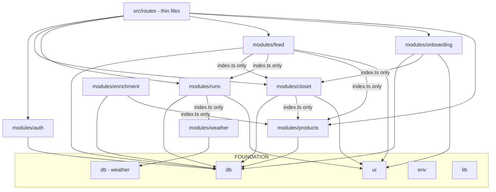
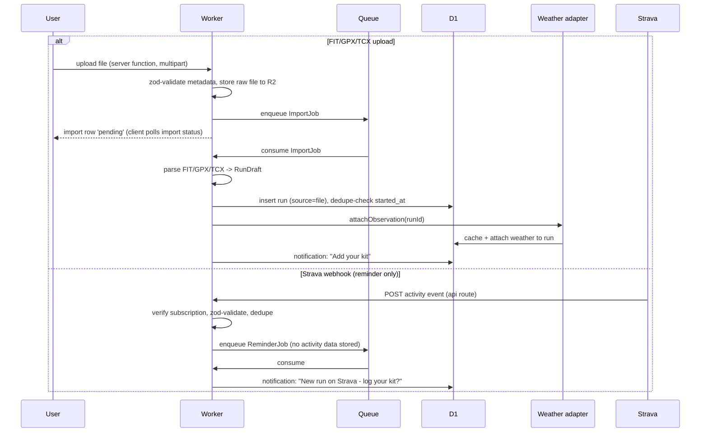
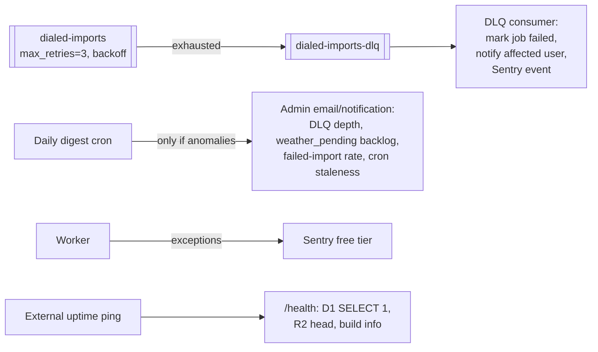

# dialed.run — Architecture

One Worker, SSR-first, everything on the Cloudflare $5 plan. This document is
the shared map: humans review against it, agents build against it. **If your
change alters a boundary shown here, update the diagram in the same PR.**

Supersedes `plan/docs/architecture.md` (htmx/Hono replaced by TanStack Start;
same backend shape).

## System context

```mermaid
flowchart LR
    U[Runner / Browser] -->|HTTPS, SSR + hydration| W

    subgraph CF[Cloudflare - Workers Paid plan]
        W[TanStack Start Worker\nSSR + server functions + API routes]
        D1[(D1: dialed-core)]
        D1W[(D1: dialed-weather)]
        R2[(R2: photos)]
        Q[[Queue: imports]]
        QE[[Queue: enrichment]]
        CRON[Cron Triggers]
    end

    W --> D1
    W --> D1W
    W --> R2
    W -->|produce| Q
    Q -->|consume| W
    W -->|produce| QE
    QE -->|consume| W
    CRON --> W

    W -->|product page fetch\nbounded, https-only| SHOP[Brand product pages\nShopify JSON / JSON-LD / OG]
    W -->|LLM extraction rung\nadapter, D-32| LLM[GPT-5.6 Luna\n(presumptive; eval decides)]

    STRAVA[Strava webhook] -->|activity event\nreminder only| W
    W -->|historical + forecast| WX[Weather provider\nVisual Crossing behind adapter]
    W -->|OAuth| IDP[Google / Strava auth]
```

Key decisions embedded here:

- **Strava data never enters the feed or the recommender.** The webhook is a
  reminder trigger only; run records are first-party (manual or file import).
- **Two D1 databases**: `dialed-core` (users, closet, runs, feed) and
  `dialed-weather` (observations cache). Weather grows unbounded; isolating
  it protects the core DB from the 10 GB per-database cap.
- **Weather is an adapter** (`modules/weather/provider/`). Visual Crossing is
  the first implementation; swapping providers is a one-directory change.
  (The design artboards label the forecast "NWS" — that's a design delta, not
  a decision; see `docs/design-deltas.md`.)

## Frontend architecture (TanStack Start)

- **SSR-first**: every page renders on the Worker; hydration gives the
  app-like interactions the design needs (picker sheets, multi-select,
  transitions) without a separate SPA or API layer.
- **Server functions are the API.** Mutations and loads are typed server
  functions in modules, invoked from loaders/components — no hand-rolled JSON
  endpoints except `src/routes/api/` for machine callers (Strava webhook,
  health checks), which parse with zod like any trust boundary.
- **Route ownership = directory ownership** (see contracts). Route files are
  thin; modules hold logic and components.
- **View layer**: five-tab shell (`ui/Layout`): Feed · Closet · +Add · Call
  (teaser until the call epic) · You. Mobile-first for logging, desktop-first
  for the closet — both responsive, no separate builds.
- **Offline is deliberately out of scope for v1** (decision D-07). Nothing may
  preclude a later service-worker/PWA layer: no reliance on in-memory session
  state across navigations, all mutations idempotent where the contract allows.

## Module dependency graph (enforced by dependency-cruiser)



Rules: modules import foundation freely; cross-module imports go through the
target module's `index.ts`; only `env/` reads bindings; route files import
modules but are imported by nothing; no cycles.

## Authentication

Asked during the PR #4 review and not written down anywhere, which is how a
mechanism that is obvious to whoever wired it becomes invisible afterwards.

**Cookie sessions, not stateless JWTs.** Better Auth with the
`tanstackStartCookies()` plugin: a session row in `DIALED_CORE` keyed by an
opaque token in an HttpOnly cookie. Sessions being rows means revocation is
real — delete the row — rather than waiting out a token's expiry.

**One mechanism for both surfaces.** A route loader and a server function are
both just requests carrying that cookie, and server functions are RPC to the
same origin, so the cookie rides along with no extra work. That is why a
single session lookup serves the UI and the "API" — there is no second
credential and no bearer-token path.

Four entry points, all in `modules/auth`, differing only in what they do when
there is no session:

| call | for | on no session |
|---|---|---|
| `requireUserId()` | server functions | throws `AuthRequiredError` |
| `requireSession()` | route loaders | redirects to `/auth/login` |
| `sessionFromRequest(request)` | raw `server.handlers` routes | returns `null`, caller decides |
| `getSession()` | anything rendering signed-out state | returns `null` |

`sessionFromRequest` exists because a raw handler has a `Request` rather than
TanStack's server context, so it cannot read headers the way the other two do.

**Detect the unauthenticated case with `isAuthRequired(error)`, never
`instanceof`.** A server function's rejection is structured-cloned across the
RPC boundary and arrives without its prototype, so `instanceof` returns false
in exactly the place the answer matters. The guard checks a `code` property,
which survives the trip.

An eslint rule rejects a module-local `requireUserId` or a direct
`auth.api.getSession` outside `modules/auth`. Four hand-written copies had
already become three incompatible error types before that rule existed, which
left no caller able to tell "session expired, sign in again" from "something
broke".

## Import pipeline (lane 102)



Manual entry is a plain server function: parse `RunDraft`, insert, attach
weather inline (degrade to `weather_pending` on failure — law 5).

## Product enrichment pipeline (lane 107)

Pasted product URL → server function validates https + resolves/creates the
product row (garment saves immediately, never blocked) → enqueue EnrichJob on
`dialed-enrichment`. Consumer: bounded fetch of the page (10s timeout, size
cap, https only, no private address space) → snapshot raw HTML to R2 →
extraction ladder: JSON-LD Product schema → Shopify `/products/<handle>.json`
→ OG tags → LLM rung (page text → `extractedProductSchema` via the
`ExtractionModel` adapter). Best data wins per field; typed columns get the
recommender-relevant core, `extracted` JSON keeps the rest, primary image is
copied to R2. Failures mark `extraction_status='failed'` and never surface as
user errors — user-entered fields are always the floor (law 5). Extraction is
idempotent and re-runnable over stored snapshots (D-31).

## Feed read paths (lane 104)

**Following feed** — fanout-on-read, one indexed query: public
`outfit_entries` joined to `follows` on author (plus self), ordered by
`created_at DESC`, cursor-paginated (created_at + id). Covering indexes:
`follows(follower_id, followee_id)` and
`outfit_entries(user_id, created_at DESC)`. No feed table, no write
amplification. Photos render from R2 via cached public bucket URLs.

**Your conditions (E2-lite)** — the consensus block only in v1: recent public
entries (last 72h, `outfit_entries(is_public, created_at DESC)` index) whose
runs' observations fall within a proximity window of the viewer's current
conditions (±3°C on feels-like, same precip class), aggregated to
per-UI-group wear counts ("15/18 wore long sleeve"). Bounded scan window +
in-Worker aggregation is fine at launch scale; the packet requires EXPLAIN
output and a row-scan cap. Manual-source observations are excluded. Stranger
cards and follow CTAs are the full-E2 epic, post-MVP.

## Rungs of verification

| Rung                       | Runs                          | Tools                                                                  |
| -------------------------- | ----------------------------- | ---------------------------------------------------------------------- |
| Stop gate (per agent turn) | diff-scoped                   | eslint, tsc                                                            |
| Commit gate                | merge-base diff + whole graph | + knip, dependency-cruiser                                             |
| CI (authoritative)         | whole repo                    | + vitest (workers pool), Playwright smoke, `wrangler deploy --dry-run` |

## Runtime resilience & solo-ops posture

Design target: **weeks of unattended operation**; the system reports by
exception, the human never polls dashboards.



- **Queues**: `max_retries: 3` with delayed retry; DLQ bound and consumed —
  a dead-lettered job becomes a user-visible failure + Sentry event, never
  silence.
- **Alerting is exception-based**: the daily digest cron emails/notifies
  **only when** thresholds trip (DLQ > 0, weather_pending > N for > 24h, any
  cron that hasn't checkpointed on schedule). A quiet inbox means healthy.
- **Uptime**: free external ping (e.g. UptimeRobot) against `/health`.
- **Backups**: D1 Time Travel gives 30-day point-in-time restore with zero
  setup — the recovery story is "restore to timestamp", documented in
  workflow.md. R2 originals are the photo source of truth; derived sizes are
  regenerable.
- **Deploys**: CI applies migrations (expand→contract only) before deploy;
  Wrangler gradual deployments + one-command rollback. A bad deploy is a
  rollback, not an incident.
- **Abuse without moderators**: Turnstile on signup, Cloudflare WAF rate
  limits on auth + upload endpoints, hard size/type caps on all uploads.
  These are free and remove the whole class of 3am problems.

## Launch gate vs post-MVP

**Launch gate** (must merge before public sign-ups): Task 106 trust & safety
floor — photo screening via Workers AI, report→hide→review, link hygiene,
ban mechanics — plus the dashboard-side CSAM scanning tool. MVP lanes
101–105 + 107 can land and be dogfooded privately without it.

**Post-MVP** (see `docs/post-mvp.md` — documented so agents don't build
toward the wrong future): the call epic (recommendation engine, vision
capture, bulk import, kits, full confidence ladder), full E2 + discovery,
gear gaps, comments, offline/PWA, affiliate engine, Polar/Fitbit adapters
behind `RunSource`, iOS app. None of these justify speculative abstraction
now — `RunSource`, `WeatherProvider`, and the nullable recommender-ready
columns (`effort`, `thermal_level`, garment attributes, `est_temp_*`) are the
only seams built ahead of need, deliberately.
