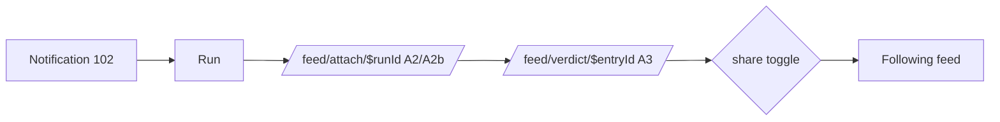

# Design: 104 Feed + Social

## Problem

The v1 social loop: attach a kit to a run (A2/A2b), give a one-tap verdict
(A3), share it, follow runners, and read two feeds (Following E1, Your
conditions E2-lite), entry detail (D), profiles (G/H), username search.

## Approach

`src/modules/feed/` holds all logic as pure query functions (db + ids in,
typed rows out — directly testable in the workers pool); `functions.ts` wraps
them in `createServerFn` with zod validators + session checks (auth via
`modules/auth` index). Upstream modules (closet/runs/weather) don't exist on
this branch, so per the packet I query `wardrobe_items`, `runs`, and
`weather_observations` module-internally against the frozen contracts; when
those lanes land, the weather reads swap to `weather`'s index API (seam noted
in code). Cross-DB join is impossible (two D1 databases), so run→observation
resolution uses the cache key (`lat_r`,`lng_r`,`hour_bucket` = round 2dp +
floor(started_at/3600)) — unique-index seeks, never a weather scan.

- **E1**: fetch followee ids (covering index), then one keyset-paginated
  query `user_id IN (self+followees) AND is_public=1 ORDER BY created_at
  DESC, id DESC` — per-user index seeks on `entries_user_created`; EXPLAIN in
  PR body + an index-coverage test.
- **E2-lite**: public entries ≤72h via `entries_public_created`, capped at
  200 rows; runs by PK; observations by cache key (chunked OR over the unique
  index; `source='manual'` excluded); ±3°C feels-like + same precip class
  (dry ≤0.1mm < damp ≤2.5 < wet); aggregate per UI group in-Worker. Scan
  bound: ≤200 core rows + ≤200 weather index seeks per render.
- **Prefill**: user's own entries (≤200 recent), nearest |feels-like Δ|,
  same precip class, recency tiebreak.
- **Photos**: ≤4/entry, jpeg/png/webp ≤10MB, keys
  `entries/{userId}/{entryId}/{photoId}` (101's key convention); originals
  only for now — derived sizes (200/600/1600 webp) follow 101's photon-wasm
  benchmark outcome rather than duplicating a wasm pipeline in parallel.
  Served via a cached GET server route `/feed/photo/$`.
- **Useful**: toggle row in `reactions`; COUNT(*) on read, no denorm (D-11).

## Contract touches

- Schema changes needed: **none**. Two flagged workarounds: (a) username
  search LIKE-prefixes `user_profiles.display_name` — no index, full scan of
  user_profiles, fine at MVP user counts; propose `idx(display_name)`
  post-merge. (b) "prompt once for missing verdict" marker is a
  `notifications` row (kind `verdict_prompt`, dedupe UNIQUE) — no column.
- New routes (`src/routes/feed/`): `index.tsx` (E1+E2 tabs),
  `attach.$runId.tsx` (A2/A2b), `verdict.$entryId.tsx` (A3),
  `entry.$entryId.tsx` (D), `me.tsx` (G), `u.$userId.tsx` (H), `search.tsx`,
  `photo.$.tsx` (R2 GET). Lane 102: deep-link notifications to
  **`/feed/attach/$runId`**. Also repoints TabBar's Feed/You placeholders
  (sanctioned by the Phase-0 comments in `src/ui/TabBar.tsx`).
- New bindings/queues/crons: **none** (existing PHOTOS/D1 bindings only).
- Screens: A2, A2b, A3, D (no comments), E1, E2-lite, G v1, H v1, search.

## Test plan (workers pool, real D1)

- `test/feed/authz.test.ts` — entry only on own run; picker shows own items
  only; private entries invisible cross-user in feed/profile/detail/consensus.
- `test/feed/feed.test.ts` — follows/self/non-follows correctness; cursor
  stable across inserts; EXPLAIN QUERY PLAN has no SCAN of
  outfit_entries/follows.
- `test/feed/consensus.test.ts` — temp/precip/72h filtering, manual-source
  exclusion, UI-group counts.
- `test/feed/verdict.test.ts` — null-verdict save, one-time re-prompt, band
  counts, noted confirmation.
- `test/feed/social.test.ts` — useful toggle + count, follow/unfollow,
  prefix search public-profile scope.

## Open questions

- Profiles are fully public at MVP (packet-directed) — known privacy call.
- "Worked N of M" = entries in the 5°C band containing the item whose run
  verdict is 0 and item unflagged; reviewer may want |verdict|≤1.
- Own profile lives at `/feed/me` (route-ownership keeps it in my dir); the
  You tab points there until a `you/` lane exists.
