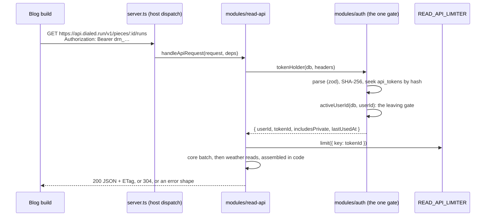

# Design: 130 personal read API

> **Status: post-launch.** Designed 2026-10-03 on the owner's requirements,
> and reshaped the same day by the owner's API ruling and round 30's
> rulings. Build **after the friends stage** (register R-126). Nothing here
> is built. When it is, this doc gets an "as built" section, the way 126's
> did.

## Problem

The owner's blog, biglongrun.com, shows a "Real-World Usage Stats" footer
on shoe reviews, pulled from Strava at build time. He wants a "Real-World
Conditions" block on **apparel** reviews (round 30's Integration
Opportunities board), sourced from dialed.run. He then plans to drop
Strava from the blog entirely. dialed.run has no way for a program to read
a runner's data: the app's only credential is a session cookie
(`docs/architecture.md` §Authentication: "no second credential and no
bearer-token path"). This lane adds one. It is a **personal, read-only,
general-purpose API**. A runner mints a token in Settings, and the token
reads that runner's own pieces and runs as JSON, server to server.

**Goals.** The raw records a caller needs to compute any view it likes:
the closet, every run a piece was worn on, and runs by date. Tokens the
runner can see, name and revoke. A caller can always tell whether a
response holds private entries. Links from a caller never 404.

**Non-goals for v1.**

- **Server-side summaries.** The server computes no totals, ranges,
  distributions or "worn with" counts; callers aggregate. A summary
  endpoint would read exactly the rows a raw fetch reads, so it saves no
  compute. What it costs is **bespoke maintenance**: one caller's view
  becomes a wire contract to version forever. A convenience summary
  endpoint can come later, once several consumers want the same one.
- Another runner's data, ever.
- Writes of any kind.
- OAuth or third-party apps. A token is the runner's own, pasted into the
  runner's own build.
- CORS or browser use. v1 sends no `Access-Control-*` headers.
- Strava data. dialed.run stores none (D-14, D-54), and this API changes
  nothing about that.

## Decisions (owner, 2026-10-03)

The API's shape:

- **General purpose.** Callers aggregate the data themselves.
- **Own host.** The API lives on `api.dialed.run`, routed to the same
  Worker.
- **Public noun.** The public API says **"piece"**, to match design's
  lexicon. `garment` stays the internal name.

Round 30's rulings (#144). The `docs/decisions.md` rows, amending D-95
and D-43, are written in the build PR and numbered past whatever has
merged by then (#142 takes D-97 and D-98):

1. **Token reads work while a runner is behind on the Terms.** This
   matches D-95's exemption for Get a copy. Revoking stays allowed too,
   and the API has no writes to refuse.
2. **A "new API token created" security email.** It is transactional and
   has no opt-out, which amends D-43's list as D-89 did.
3. **Any runner can create tokens.** This supersedes the board's "only the
   owner makes tokens in v1".
4. **A revoked token gets its own 401.** Its code is distinct from an
   unknown or malformed token's.

## Prior art: the blog's Strava footer, and how the new block is computed

`biglongrun.com/src/lib/strava/` fetches every activity in a ±2-year
window, filters by `gear_id`, and computes `lifetime` and `reviewTime`
(activities up to `publishDate`) in `aggregator.ts`. The new block works
the same way. **The blog fetches raw runs and aggregates them itself.**

**At review and Lifetime come from one fetch.** Call
`GET /v1/pieces/:id/runs`, which takes one or two pages for a piece. That
list is Lifetime. At review is the same list filtered client-side to
`startedAt ≤` the review's publish day. `?asOf=` exists for a caller that
wants only At review. The blog needs both, so it fetches once without
`asOf` and filters. The response's `ETag` makes an unchanged piece a 304
on the next build.

```ts
// src/lib/dialed/aggregator.ts — the blog's side, sketched
const runs = await allPages(`/v1/pieces/${pieceId}/runs`); // 1–2 requests
const bands = await getBands(); // 1 request, cached
const atReview = runs.filter((r) => Date.parse(r.startedAt) <= reviewDayEndMs); // offsets differ, so compare instants

function record(rs: Run[]) {
  const felt = rs.flatMap((r) => (r.conditions?.feelsLikeF == null ? [] : [r]));
  return {
    runsWorn: rs.length, // "Runs Worn 23"
    feelsLike: minMax(felt, (r) => r.conditions.feelsLikeF), // "27–49°F" (or C)
    dialed: count(rs, (r) => r.verdict === "dialed"), // "Dialed 15 of 23"
    period: [first(rs).startedAt, last(rs).startedAt], // "Worn Period"
    byBand: bands.map((b) => {
      // "By conditions"
      const inBand = felt.filter((r) => inRange(r.conditions.feelsLikeC, b));
      return {
        label: b.labelF,
        runs: inBand.length,
        verdicts: tally(inBand, (r) => fold(r.verdict)), // cold · dialed · warm: the blog's words
        href: b.guidePublished ? b.guideUrl : null,
      }; // plain text when unpublished
    }),
    sky: tally(rs, (r) => r.conditions?.sky), // "Dry 14 Damp 6 Rain 2 Snow 1"
    wornWith: top(
      tallyMany(rs, (r) => r.wornWith),
      3,
    ), // "Most often worn with"
    rows: rs.map((r) => ({
      date: r.startedAt,
      tz: r.timeZone, // "View all 23 runs"
      feels: r.conditions?.feelsLikeF,
      sky: r.conditions?.sky,
      verdict: r.verdict,
      href: r.entryUrl ?? null,
    })),
    // Strava-block parity, if wanted: distance, duration and pace per run,
    // summed and weighted exactly as aggregator.ts does today.
  };
}
```

| Board stat (Integration Opportunities 01) | Computed by the blog from                                                                     |
| ----------------------------------------- | --------------------------------------------------------------------------------------------- |
| Runs Worn                                 | `runs.length`                                                                                 |
| Feels-like Range                          | min and max of `conditions.feelsLikeF` (or `…C`) over runs that have one                      |
| Dialed N of M                             | count of `verdict === "dialed"`                                                               |
| Worn Period                               | first and last `startedAt`                                                                    |
| By conditions: band, runs, how it went    | `/v1/bands` ranges × `conditions.feelsLikeC`; tally `verdict`, folded to cold, dialed or warm |
| Band links                                | `guideUrl` when `guidePublished`, else plain text                                             |
| Sky                                       | tally of `conditions.sky`                                                                     |
| Most often worn with                      | tally of `wornWith[].id`, named by `wornWith[].name`                                          |
| Run rows: date, feels like, sky, verdict  | the run fields directly; the date links to `entryUrl` when present                            |
| Strava-style distance, pace, totals       | `distanceM` and `durationS`, as `aggregator.ts` sums them                                     |

**What dialed.run lacks next to Strava, which the blog must accept:**

- **No elevation.** `runs` holds `startedAt`, `durationS`, `distanceM`,
  `lat`, `lng`, `indoor`, `effort` and `title`; nothing else. Conditions
  come from `DIALED_WEATHER`.
- **Only runs logged in dialed.run.** A piece's runs are the runs whose
  kit names it. There is no gear auto-assignment, and nothing from before
  the runner started logging.
- **Elapsed, not moving, time.** FIT gives `totalElapsedTime`, so a pace
  here reads slower than Strava's moving pace for the same run.

**Where the board and this doc differ, by the owner's ruling:**

- **One endpoint or several.** The board drew one summary endpoint,
  `/v1/pieces/{id}/record`. The ruling replaced it with raw runs and no
  summaries.
- **Start times.** The board said "dates only, no start time". The ruling
  asks for the start instant with its time zone, for Strava time-matching.
  Location is still never sent.
- **Revoked tokens.** The board's "revoked = 404, render nothing" becomes
  a distinct 401. The blog treats 401 and 404 alike: it renders no block
  and logs a build warning.

## Approach

### Shape



- **Host, not path.** `api.dialed.run` is a route to the same Worker, and
  the route is added to `wrangler.jsonc` in the build PR. `server.ts`
  sends a request whose host is the API host to `read-api`'s
  `handleApiRequest` before TanStack Start sees it. The app never serves
  `/v1/*`, and the API host serves nothing else. The router is a small
  `URLPattern` table inside the module. That keeps every line of it
  importable by worker tests, and so mutation tested, unlike a route file.
  The host name lives in one registry beside `ops/crons.ts` and
  `ops/queues.ts`. `bindings-conformance` asserts the route matches it (law
  10).
- **No cookie ever arrives.** The app's auth cookies are scoped to
  `app.dialed.run`: they are host-only, because Better Auth's
  `crossSubDomainCookies` is off. A browser therefore never sends one to
  `api.dialed.run`, so token auth is the only way in and **CSRF is ruled
  out by design**. A test pins the auth config's cookie scope. The
  handler also ignores any `Cookie` header, as a second line of defence.
- **`modules/read-api`** (new): request parsing (`inputs.ts`), the router,
  the queries, the run shaping, `ETag`s, the error shapes (`respond.ts`)
  and the one reader of the limiter binding (`rate-limit.ts`). It reads
  `db` directly, as `feed` does. It reaches `DIALED_WEATHER` only through
  `weather`'s barrel, and auth only through `auth`'s.
- **Token lifecycle lives in `modules/auth`**: `bearer.ts` (pure: format,
  parse, hash), `api-tokens.ts` (mint, list, revoke, `tokenHolder`) and
  `components/ApiTokens.tsx`, wired by `routes/account/$section.tsx` as
  `ChangePassword` already is. **Not `modules/account`:**
  `auth/terms-gate.ts` imports account's barrel, so account importing auth
  back would be a cycle.

### Data model (additive, two migrations)

`api_tokens`, core DB. Migration `add_api_tokens`:

| column             | type                         | note                                                     |
| ------------------ | ---------------------------- | -------------------------------------------------------- |
| `id`               | text PK                      | ULID; the limiter key, and what Sentry and logs name     |
| `user_id`          | text not null                | the owner                                                |
| `name`             | text not null                | 1–40 chars, zod in `lib/contracts`                       |
| `token_hash`       | text not null                | SHA-256 of the whole token, lowercase hex                |
| `token_prefix`     | text not null                | `drn_` plus the first 6 secret chars, for display only   |
| `includes_private` | integer boolean, default `0` | "Shared entries only" is `0`; fixed at creation          |
| `idempotency_key`  | text                         | law 8b                                                   |
| `created_at`       | integer not null             | epoch seconds, as everywhere                             |
| `last_used_at`     | integer                      | throttled (below)                                        |
| `revoked_at`       | integer                      | set once; the row stays, which is what makes 401-revoked |

Indexes:

- `UNIQUE api_tokens_hash (token_hash)`, for the per-request seek;
- `api_tokens_user_created (user_id, created_at)`, for Settings' list;
- `UNIQUE api_tokens_idempotency (user_id, idempotency_key)`.

Migration `add_entry_items_item_index`: `outfit_entry_items (item_id,
entry_id)`. Today the only index there is `entry_items_pk (entry_id,
item_id)`, which leads with the entry. So "every run this piece was worn
on" would scan every runner's kit rows.

Both are additive, so the schema protocol says proceed and say so in the
PR. They are numbered past whatever `main` and the open PRs hold at build
time. Today that is past `0043` (#142).

**`includes_private` is fixed at creation.** Flipping it would silently
change what an existing caller receives. To change it, make a new token.

**Account deletion** adds `apiTokens` to `account/purge.ts`'s `byUserId`
list and to `purge.test.ts`'s footprint. While the account is leaving, the
gate refuses its tokens, and Keep restores them. **Ban** revokes them in
`banUser`'s own batch (`UPDATE api_tokens SET revoked_at = ? WHERE user_id
= ? AND revoked_at IS NULL`). That mirrors the session delete there: a
claim and its enforcement go together. A banned runner cannot mint a new
token, because minting needs a session.

**Export** gains `tokens.csv`, round 30 #6's name: name, prefix, flag,
created, last used, revoked. The hash is never exported.

### Auth: the token path through the one gate

`Authorization: Bearer drn_<43 base64url chars>`. That is 32 random bytes
from `crypto.getRandomValues`, so 256 bits. The value is shown once, in
the create response, and never stored, logged or sent to Sentry.

`tokenHolder(db, headers)` in `auth/api-tokens.ts`:

1. **Parse.** The header goes through a zod schema. A missing or malformed
   header is refused as `invalid_token`, with no database read.
2. **Look up.** Hash with `crypto.subtle.digest("SHA-256", …)` and seek
   `api_tokens` by `token_hash`. No row means `invalid_token`. A revoked
   row means `token_revoked`, plus a Sentry report naming the token id and
   user id: use of a revoked token is the sign that it leaked.
3. **Gate.** Hand the row's user id to **`activeUserId`**
   (`auth/leaving-gate.ts`), which is exactly `requireUserIdBeforeTerms`'s
   decision. A leaving account gives `AccountLeavingError`. A runner
   behind on the Terms is **not** refused (decision 1, D-95's
   exemption). This is still the one gate: the token stands in for the
   session and joins `terms-exempt.test.ts`'s named list, as Get a copy
   did.

**Settings' side.** Listing and revoking use `requireUserIdBeforeTerms`,
so a runner behind on the Terms can still revoke. Creating uses
`requireUserId`: new access waits for the Terms, while reading through an
existing token does not. Any runner may create tokens (decision 3), up to
10 live ones.

**The security email (decision 2).** The token insert's batch also writes
an outbox row of kind `email` with template `api_token_created`, carrying
the token's name, prefix and creation time, never its value. That follows
126's rule for secondary mail (law 8c). The template is an addition to
`lib/contracts/email.ts`'s union (law 9). It is transactional, so it has
no preference row and no switch. Its copy says how to revoke.

**Read-only is structural.** The bearer is read in one place, and only the
API host's `GET` routes call it. Server functions read the session cookie,
and Better Auth's `bearer` plugin stays off.

### Endpoints (`https://api.dialed.run/v1/…`, `GET`, JSON)

Every body carries `includesPrivate: boolean`. Instants are ISO 8601 with
the run's UTC offset, plus an IANA `timeZone` when known. Distances are
metres and durations seconds. Temperatures come in **both °F and °C**, so
a caller's unit switch needs no second request. Wind comes in both kph
and mph.

| endpoint                                          | returns                                                                                  |
| ------------------------------------------------- | ---------------------------------------------------------------------------------------- |
| `/v1/pieces`                                      | the closet: `id`, `name`, `brand`, `category`, `type`, `retired`, `retiredAt`, `addedAt` |
| `/v1/pieces/:id`                                  | one piece, same fields                                                                   |
| `/v1/pieces/:id/runs?asOf=&since=&cursor=&limit=` | every run the piece was worn on, newest first, paginated                                 |
| `/v1/runs?from=&to=&cursor=&limit=`               | runs in a window, for general use and Strava time-matching                               |
| `/v1/bands`                                       | the feels-like bands, with `guidePublished` and `guideUrl`                               |

**A run** (both run endpoints):

- `id`, `startedAt` (with offset), `timeZone`, `title`, `distanceM`,
  `durationS`, `indoor` and `effort`.
- **`conditions`**, or `null` for indoor and unlocated runs:
  - `source`: `observed` or `manual`;
  - `tempC`/`tempF` and `feelsLikeC`/`feelsLikeF`. For a manual band these
    are its low and high in both units (`tempBand`), never a midpoint
    (round 26 #2);
  - `windKph`/`windMph`;
  - `sky`: `dry`, `damp`, `rain` or `snow`. On a manual run it is the
    runner's pick. On an observed run it is derived from precipitation
    through `precipClassOf`, with wet read as `rain`. That is the rule
    `ConditionsTab` already shows, moved to `lib` so both read one copy.
    Snow needs the provider's condition text, and the build PR adds it to
    that one rule, not here.
- **`verdict`**: a key word, `way_cold`, `a_bit_cold`, `dialed`,
  `a_bit_warm` or `way_warm`, or `null` for none. The wire map lives in
  the v1 contract as a `Record<VerdictValue, …>` over `verdictScale`, so
  the compiler demands every value. The internal tokens are `bit_cold` and
  `bit_warm`, but these are wire words and are fixed for v1.
- **`visibility`** is `shared` or `private`. **`entryUrl`** is
  `https://app.dialed.run/feed/entry/<entryId>`, present only when the run
  is shared.

The piece-runs endpoint adds:

- `piece`: this piece's `flag` and `note` on the run;
- `wornWith`: the **other pieces in that kit**, as ids and names, so a
  caller can compute "worn with".

The runs endpoint adds:

- `kit`: every piece in the run's kit, with id, name, flag and note.

**Visibility.** A run is `shared` exactly when the public can see its
entry: `is_public = 1 AND moderation_status = 'ok'`. A run with no entry,
an unshared entry, or an entry that moderation hid or removed is
`private`. A shared-only token returns `shared` runs and nothing else, and
the filter is SQL (below). An include-private token returns both, and
private rows carry no `entryUrl`.

**Pieces under either token.** The closet list is closet facts, not
entries, so both token kinds see the whole closet. The flag governs
entries, which is what the owner asked it to govern. Retired pieces answer
normally, since reviews outlive gear.

**Parameters.**

- **`asOf`** caps runs at that date, through the end of that UTC day, so
  the review's own day counts.
- **`since`** is for incremental fetches, and returns runs that started
  on or after the given instant. A verdict edited on an older run is not
  "since". A changed-since filter would need an `updated_at` on entries
  (open question 3).
- **`from` and `to`** take a date or an instant; a bare date is a whole UTC
  day.
- **`cursor`** is opaque base64url of `(startedAt, id)`, parsed by zod.
- **`limit`** defaults to 200, which is also the cap.

**`/v1/bands`.** The 5 °C feels-like bands that `bandFloorC` and
`bandLabel` already define, from −20 °C to 40 °C. The range moves to `lib`
from `runs/run-conditions.ts` so both read one table. Each band has an
`id` (`"0-5c"`), `floorC`, `ceilingC`, `labelC` and `labelF`,
**`guidePublished`**, and `guideUrl` (`null` unless published). The
endpoint is served from the **nightly guide artifact**, which records
which guide pages exist. That fact is the one thing only dialed.run knows,
and it is why a caller's band link never 404s. The response is the same
for every token, so it is cached in the Workers Cache API for a day and
carries an `ETag`. **The guide artifact does not exist yet.** The guides
themselves are #144's conflict 3, an owner call under D-58. Until it
exists, every band answers `guidePublished: false`, so callers render
plain text, which is correct rather than broken.

### Queries, indexes and the cross-database join

- **Piece runs: one `db.batch()`.** It reads the piece by primary key and
  `user_id`, then its runs page:
  `outfit_entry_items i JOIN outfit_entries e ON e.id = i.entry_id JOIN runs
r ON r.id = e.run_id WHERE i.item_id = ? AND e.user_id = ? [AND
e.is_public = 1 AND e.moderation_status = 'ok'] [AND r.started_at <= asOf]
[AND r.started_at >= since] AND (r.started_at, r.id) < cursor ORDER BY
r.started_at DESC, r.id DESC LIMIT limit + 1`. That is a seek on the new
  `(item_id, entry_id)` index, then primary-key probes. A second batch
  reads the page's kits (`outfit_entry_items` by `entry_id`, a chunked
  `IN` on the pk index) and the pieces they name (`wardrobe_items` by id).
- **Runs window.** `runs LEFT JOIN outfit_entries ON run_id WHERE user_id
AND started_at BETWEEN …` on `runs_user_started`, with the same kit
  batch after it.
- **Visibility and paging are SQL, never filters after `LIMIT`.** Done in
  memory, they would return "the survivors of the first page", which is
  CLAUDE.md's named bug.
- **Weather is assembled in code, deliberately.** The weather barrel's
  `observationsForRuns` and `manualReadingsForRuns` read the page's run
  ids from `DIALED_WEATHER`. That is a separate database, so no SQL join
  can correlate a run with its observation (the exception CLAUDE.md
  names), and the two halves meet by run id in code. A `weather` export
  that takes the located rows directly would save `observationsForRuns`'
  re-read of `runs` for coordinates, and is worth adding at build time.

### Cost controls, with rough numbers

The controls:

1. **Per-token rate limit.** Cloudflare's Workers Rate Limiting binding,
   `READ_API_LIMITER`:
   `ratelimits: [{ name: "READ_API_LIMITER", namespace_id: "<next free>",
simple: { limit: 60, period: 60 } }]`. It is called with `await
env.READ_API_LIMITER.limit({ key: tokenId })` after the gate, so it is
   keyed by token and never by IP. `{ success: false }` is a 429 with
   `Retry-After: 60`. Counts are per Cloudflare location and approximate
   ("not an accurate accounting system"), which is fine for a ceiling.
2. **Capped pagination.** At most 200 runs a page.
3. **`ETag` and `If-None-Match`.** The `ETag` is a hash of the body, and
   an unchanged page answers 304 with no body. Be honest about what that
   saves: transfer and the caller's parse, not D1 reads. No per-runner
   change marker exists to answer a 304 without running the query. A
   write counter on `user_profiles` would buy that, and is not worth it at
   these numbers.
4. **`since=`.** An incremental caller fetches only new runs.

**Typical load.** A piece is worn on roughly 50–300 runs, which is one or
two pages. The blog's ~30 apparel and shoe reviews (8 today) are 30–90
requests a nightly build, plus one `/v1/bands`. That is about 2,700
requests a month against Workers Paid's 10M included. A page reads about
13 rows a run: the kit-item seek, the entry and run probes, around 5 kit
rows and 5 piece names, and the weather cell. So 300 runs is about 4,000
rows, and a nightly build is at most about 360k rows, or about 11M a month
against D1's 25B included. That is negligible on both.

**The real risk** is a token, leaked or in a runaway loop, scraping full
history forever. The rate limit bounds it at 60 requests a minute. At 200
runs a page, that is at most about 225M rows read a day per token, or
about 7B a month. That is within the 25B included, and at list overage
prices (about $0.001 per million rows read, $0.30 per million requests)
it is a few dollars a month per token at worst. The 10-token cap bounds a
runner. Last-used and Revoke make it visible and stoppable, and use of a
revoked token reports.

**Wrangler changes.** The limiter binding is **pre-approved** (owner,
2026-10-03), to be made in the build PR, and goes in
`test/wrangler.test.jsonc` too. The `api.dialed.run` route follows the
owner's host decision and lands in the same PR. `bindings-conformance`
asserts both, plus `read-api/rate-limit.ts` as the binding's only reader
(law 10). `env.d.ts` is regenerated. **Cost:** Cloudflare's docs state no
price for the binding. Secondary sources say there is no charge beyond
Workers requests and CPU. **The owner confirms on the billing dashboard
after enabling it.**

### Errors

One shape: `{ "error": { "code": "…", "message": "…" } }`, with the codes
in the v1 contract.

| status | code                   | when                                                                                         |
| ------ | ---------------------- | -------------------------------------------------------------------------------------------- |
| 304    | —                      | `If-None-Match` matches                                                                      |
| 400    | `invalid_request`      | a parameter fails its zod schema; the message names the parameter, never echoes input        |
| 401    | `invalid_token`        | missing, malformed or unknown; `WWW-Authenticate: Bearer error="invalid_token"`              |
| 401    | `token_revoked`        | the token existed and was revoked (decision 4), so the caller knows to mint a new one        |
| 403    | `account_leaving`      | the account is set to be deleted                                                             |
| 404    | `not_found`            | absent, someone else's, or private under a shared-only token, deliberately indistinguishable |
| 405    | `method_not_allowed`   | anything but `GET`                                                                           |
| 429    | `rate_limited`         | the limiter said no; `Retry-After`                                                           |
| 503    | `upstream_unavailable` | a weather read failed                                                                        |

**Why 503 and not degrade (law 5):** callers bake the response into
static pages. Silently dropping conditions would publish wrong numbers
until the next build, and here the conditions are the thing asked for.
An unexpected throw is a 500, reported to Sentry with the user id, token
id and route. The `Authorization` header is never included: the reporter
gets context, not the `Request`.

### `last_used_at` without a write per request

The gate's seek already returns `last_used_at`. The handler writes only
when it is null or more than an hour old (`UPDATE … WHERE id = ? AND
(last_used_at IS NULL OR last_used_at < ?)`). The write goes through
`waitUntil`, and a failed one is caught and reported (law 5). Two
concurrent stale reads both write. That is harmless, and the `WHERE` makes
it converge. A nightly build is one write per token.

### Security

- **Hash comparison.** 256 random bits make a fast unsalted SHA-256 right.
  Slow hashes exist for guessable secrets, and a pepper would need a new
  secret binding and buy nothing. The unique-index seek is the
  comparison. Its timing can reveal at most something about a hash, which
  is useless without a preimage.
- **Leaks.** `drn_` makes tokens easy to grep for and to scan (open
  question 5). Revocation is immediate, because every request reads the
  row. Use of a revoked token reports. The creation email tells the
  runner about a token they did not make.
- **Rotation.** No expiry in v1 (open question 2). Mint a new token, swap
  the caller's secret, then revoke the old one. Last-used shows when the
  old one goes quiet.
- **Creation is law 8b's.** The form sends an `idempotencyKey`. On a
  replay only the hash exists, so the server returns the first call's row
  without the value and says so.

### Durable links from the blog (owner, 2026-10-03)

**The links themselves are durable.** `/feed/entry/:entryId` is keyed by
a ULID, so it dies only if the entry is deleted. **Who can open them is
the problem.** Under D-58 a signed-out reader sees nothing, and sign-up is
invite-only. The owner chose **options 1 and 2 together**:

1. **The blog renders the block inline from the API**: the computed record
   and the whole run list. The review's content never depends on a reader
   following a link.
2. **Each shared run carries an `entryUrl`; a private run carries none.**

   **A signed-out visitor who opens one gets a landing page**, not today's
   bare bounce to log-in. It says what dialed.run is, and offers "Request
   access" while sign-up is invite-only, plus "Log in". **It reveals
   nothing of the entry (D-58)**: no handle, no kit, no photo, no
   conditions, and no hint of whether the entry exists. Every id,
   including a made-up one, gets the same page. It keeps `noindexHead`.
   The choice between entry and landing is a decision in
   `feed/route-decisions.ts`, rendered by a component under
   `feed/components/`, so the route stays glue.

   **After signing in, the visitor returns to that entry.** Checked
   2026-10-03, and today they do not. Log-in honours a validated
   `redirect`: `auth/sign-in-search.ts` parses it with `returnPathSchema`
   from `lib/return-path.ts` (#140), and Google's `googleReturn` carries
   it. But `feed/redirect.ts`'s `requireSignedIn` redirects to a bare
   `/auth/login` and drops the path. **The fix is small:**
   `requireSignedIn(session, returnTo)` passes the route's `location.href`
   as `search.redirect`, as `sessionOrRedirect` already does. The landing's
   "Log in" carries the same value. A new visitor's "Request access" leads
   to an invite email days later, on a different link, so the entry is
   not carried back. That is accepted.

3. **No per-entry public mode** ("publish to the web") was **considered
   and rejected.** It would reverse D-58 for chosen entries, bringing a
   signed-out read path, index exposure and a moderation surface the open
   web can reach. Option 1 already puts the content on the blog.

### Design deltas

**Both surfaces were undrawn when this doc was written:**

- **Settings › Account › API tokens**: list, create, shown once, revoke
  confirm, 10 max, the notice email, `tokens.csv`. The flag sits beside
  each token, labelled "Shared entries only" or "Include my private
  entries".
- **The signed-out entry landing.**

**Round 30 draws both**, as items 6 and 5 of #144, which is still open.
Until #144 merges they stay `docs/design-deltas.md` open-queue entries, to
be built under the placeholder protocol. Once it merges they are built to
those boards. Round 30 names the return parameter `next`, while the code
parses `redirect` (open question 6).

## Contract touches

- Schema: `add_api_tokens` (new table) and `add_entry_items_item_index`.
  Both are **additive**: proceed, and say so in the build PR.
- Bindings and config, in the build PR:
  - `READ_API_LIMITER`, **pre-approved**;
  - the `api.dialed.run` route, per the owner's host decision.
- No new route files. The API host dispatches in `server.ts` to
  `modules/read-api`.
- Email: an `api_token_created` template (an addition to the union), and
  D-43 amended.
- Decisions: D-95 and D-43 are amended (round 30), with the rows written
  in the build PR.
- Docs: `docs/architecture.md` §Authentication is rewritten, because "no
  bearer-token path" stops being true. `docs/contracts.md` gains the v1
  contract (`lib/contracts/read-api-v1.ts`).
- Versioning: within v1, only new optional fields. A rename, a removal or
  a meaning change is `/v2/`, with both served until callers move. A test
  pins v1's field set (`z.toJSONSchema`).
- Screens: the API tokens page and the signed-out entry landing (Design
  deltas above).

## Test plan

Worker pool unless marked.

- **`test/auth/api-tokens.test.ts`**:
  - mint returns the value once and stores only the hash;
  - a malformed header is refused before any read;
  - unknown is `invalid_token`; revoked is `token_revoked` and reports;
  - a leaving account is refused, and Keep restores it;
  - **behind on the Terms still reads**, and revoke works too;
  - `banUser` revokes tokens in its batch;
  - creation writes the `api_token_created` outbox row in the same batch;
  - a replay returns the row without the value;
  - the cap of 10.
- **`test/architecture/terms-exempt.test.ts`**: the token path is on the
  named list.
- **`test/account/purge.test.ts`**: the footprint includes `api_tokens`.
- **`test/read-api/router.test.ts`**:
  - the API host serves only `/v1/*`, and the app host never serves it;
  - only `GET`;
  - a `Cookie` header is ignored.
- **`test/read-api/piece-runs.test.ts`**:
  - someone else's piece is 404;
  - shared-only excludes unshared, hidden and removed entries;
  - private rows carry no `entryUrl`;
  - `includesPrivate` matches the token;
  - `asOf` includes its own day, and `since` is honoured;
  - `wornWith` excludes the piece itself;
  - °F and °C agree;
  - manual bands give low and high, never a midpoint;
  - the verdict words cover every `verdictScale` value;
  - a weather failure is 503.
- **`test/read-api/runs.test.ts`**: the window, and cursor stability across
  equal `started_at`. **250 private runs and 1 shared one returns the
  shared one** under a shared-only token, which is the `LIMIT` bug as a
  test.
- **`test/read-api/bands.test.ts`**:
  - bands derive from `bandFloorC` and `bandLabel`;
  - with no artifact, every band is unpublished;
  - a published band carries its URL;
  - it is cached.
- **`test/read-api/etag.test.ts`**: a matching `If-None-Match` is 304, and
  any change in the body changes the `ETag`.
- **`test/read-api/rate-limit.test.ts`**: a fake limiter returning
  `success: false` gives 429 and `Retry-After`; the key is the token id.
- **`test/read-api/last-used.test.ts`**: the throttled write, and a failed
  write leaves the response intact.
- **`test/read-api/query-plans.test.ts`**: `EXPLAIN QUERY PLAN` shows
  `SEARCH … USING INDEX` for each statement.
- **`test/lib/read-api-v1.test.ts`**: every endpoint's output parses, and
  v1's field set is pinned.
- **`test/bindings-conformance.test.ts`**: the limiter in both configs
  with one reader, and the API host route.
- **Read-only, as a test**: a server function called with a valid `drn_`
  bearer and no cookie is `AuthRequiredError`.
- **`test/feed/redirect.test.ts`**: `requireSignedIn` carries `returnTo`.
  Signed out, the entry decision picks the landing for a real id and a
  made-up one alike.
- **`ui` project**:
  - `ApiTokens.dom.test.tsx`;
  - the landing renders nothing of the entry, and its "Log in" carries the
    path.
- **Mutation**: `modules/read-api` joins `stryker.conf.json`'s array in
  the PR that finishes it.
- **e2e**: demo specs and a video for the tokens page and the landing
  journey (signed out → entry link → log in → the entry).

## Rollout: the blog cutover (described, not built here)

1. **Enable.** Build this. The owner enables the binding and the route,
   then checks billing.
2. **Token.** Mint a **shared-only** token named "biglongrun build". Store
   it as `DIALED_API_TOKEN` in the blog's `.env` and GitHub Actions
   secrets, beside the Strava three in `deploy.yml`.
3. **Frontmatter.** Add `dialedPiece: z.string().optional()` (the board's
   name) on the `apparel` **and** `shoes` branches of `scoresUnion`. They
   are strict objects, so the field must be declared. Per-item ids are
   rejected, as `stravaId` is.
4. **Client.** `src/lib/dialed/` fetches with `AbortSignal.timeout`, its
   own zod parse, `If-None-Match`, and `Retry-After` on 429, then computes
   the record as above. It **fails the build if `includesPrivate` is
   true**, as defence in depth beside the token's flag. On 401 or 404 it
   renders no block and logs a warning. The `USE_FIXTURE_DATA` fixture
   carries over.
5. **Component.** `DialedConditions.astro` sits under, then replaces, the
   Strava block. It keeps the same At review and Lifetime tabs, the
   blog's own words and colours, and the °F/°C switch with no second
   request. A worn-with name links only if the blog reviewed that piece,
   through a `dialedPiece` → slug map. Run dates link to `entryUrl`.
6. **Retire Strava.** The one review with a `stravaId` moves once its
   shoe has a `dialedPiece`. Then the blog deletes `src/lib/strava/`, both
   Strava components, `STRAVA_INTEGRATION.md`, the setup script and the
   three secrets.
7. **Strava↔dialed.run matching**, if still wanted, is a blog-side
   authoring script. It reads `/v1/runs?from&to` and matches by start
   instant. dialed.run never stores a Strava id, and cross-links use
   dialed.run ids.

## Open questions

1. **The shoe review's history.** dialed.run knows only runs logged there,
   so the one Strava-backed shoe review loses runs that predate logging.
   The options: re-log them as files, accept the shorter history, or drop
   that footer.
2. **Expiry.** The proposal is none in v1, because a build token that
   expires breaks a deploy. Should there be an optional expiry date?
3. **What `since` means.** It means "started since" today. Changed-since
   (edited verdicts and flags) needs an additive `updated_at` on entries.
   Is that worth it, given that `ETag` already makes an unchanged piece
   cheap on the wire?
4. **Does moderation count as private?** The proposal is that hidden and
   removed entries read as `private`, so a caller never republishes them.
5. **Secret scanning.** Should `drn_` be registered with GitHub's secret
   scanning partner program? The proposal is not in v1.
6. **`next` or `redirect`.** Round 30 calls the return parameter `next`;
   the code parses `redirect`. The proposal is to keep `redirect` and
   treat the board's name as its own.
7. **Copy.** The show-once warning, the replay message, the email, and the
   landing's text are user-facing wording. Round 30's boards answer most
   of it once #144 merges; the rest needs the owner's words.
