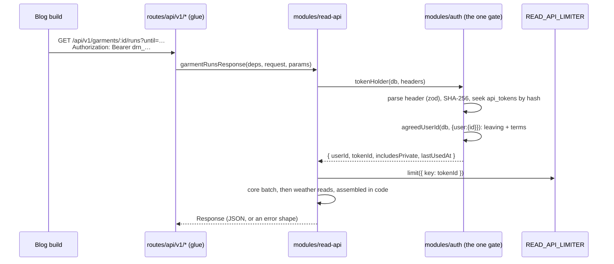

# Design: 130 personal read API

> **Status: post-launch.** Designed 2026-10-03 on the owner's requirements;
> build **after the friends stage** (register R-125). Nothing here is built.
> When it is, this doc gets an "as built" section, the way 126's did.

## Problem

The owner's blog, biglongrun.com, shows a "Real-World Usage Stats" footer
on shoe reviews, pulled from Strava at build time. He wants the same footer
on **apparel** reviews, and dialed.run is where apparel is logged. He then
plans to drop Strava from the blog entirely. dialed.run has no way for a
program to read a runner's data: the app's only credential is a session
cookie (`docs/architecture.md` §Authentication: "no second credential and no
bearer-token path"). This lane adds one. It is a **personal, read-only API**.
A runner mints a token in Settings, and the token reads that runner's own
garments and runs as JSON, server to server.

**Goals.** The blog footer's data for one garment, in one request. Runs by
date window, and one run by id. Tokens the runner can see, name and revoke.
The consumer can always tell whether a response holds private entries.

**Non-goals.** Another runner's data, ever. Writes of any kind. OAuth or
third-party apps: a token is the runner's own, pasted into the runner's own
build. CORS or browser use: v1 sends no `Access-Control-*` headers, so a
browser cannot read a response. Strava data: dialed.run stores none (D-14,
D-54), and this API does not change that.

## Prior art: the blog's Strava footer

`biglongrun.com/src/lib/strava/` fetches every activity in a ±2-year window
around the review date, filters by `gear_id` in memory, and aggregates
(`aggregator.ts`). It produces `lifetime` and `reviewTime` (activities up to
`publishDate`), each a `StravaStatsData`. `StravaShoeStats.astro` renders
the "At Review / Lifetime" toggle. `StravaActivityList.astro` renders "View
all N runs", each row linking to the Strava activity.

| Blog (`StravaStatsData`)         | Read API v1 (`stats.lifetime` / `stats.atReview`)                |
| -------------------------------- | ---------------------------------------------------------------- |
| `totalDistance` (mi)             | `totalDistanceM`                                                 |
| `totalRuns`                      | `runCount`                                                       |
| `totalMovingTime`                | `totalDurationS`, which is **elapsed** time (see below)          |
| `averagePace` (time ÷ distance)  | `averagePaceSPerKm`, same weighted formula                       |
| `fastestPace` / `slowestPace`    | `fastestPaceSPerKm` / `slowestPaceSPerKm`                        |
| `averageDistance`                | `averageDistanceM`                                               |
| `totalElevationGain`             | **none**: dialed.run records no elevation                        |
| `dateRange.first/last` (strings) | `dateRange.first/last`, ISO instants; the blog formats           |
| —                                | `conditions` (temp, feels-like, wind, precip ranges), `verdicts` |
| `activities[]`                   | `runs[]`, with `atReview: boolean` on each when `until` is given |
| activity `name`, `url`           | run `title`, `entryUrl` (shared runs only; see Durable links)    |
| activity `pace`, `movingTime`    | run `paceSPerKm`, `durationS`                                    |
| —                                | run `conditions`, `verdict`, `garment.flag/note`, `visibility`   |

**What dialed.run lacks next to Strava, which the blog must accept:**

- **No elevation.** `runs` holds `startedAt`, `durationS`, `distanceM`,
  `lat`, `lng`, `indoor`, `effort` and `title`; nothing else. Conditions
  come from `DIALED_WEATHER`.
- **Only runs logged in dialed.run.** A garment's runs are the runs whose
  kit names it (`outfit_entry_items`). There is no gear auto-assignment and
  no history from before the runner started logging.
- **Elapsed, not moving, time.** FIT gives `totalElapsedTime`
  (`runs/parsers/fit.ts`), and a manual run is what the runner typed. A
  pace here reads slower than Strava's moving pace for the same run.

## Approach

### Shape



- **Routes**: `src/routes/api/v1/garments.ts`,
  `garments.$garmentId.runs.ts`, `runs.ts`, `runs.$runId.ts`. Each is a
  `server.handlers` route with only `GET`. Each passes `env`'s bindings and
  `request` to one module function that returns a `Response`. That is the
  `account/export.$token.ts` shape, so `server-functions-are-glue` holds
  without an exemption.
- **`modules/read-api`** (new): request parsing (`inputs.ts`), the queries,
  the pure stats (`stats.ts`), the error shapes (`respond.ts`) and the one
  reader of the limiter binding (`rate-limit.ts`). It reads `db` directly,
  like `feed` does. It reaches `DIALED_WEATHER` only through `weather`'s
  barrel (`observationsForRuns`, `manualReadingsForRuns`), and auth only
  through `auth`'s.
- **Token lifecycle lives in `modules/auth`**: `bearer.ts` (pure: format,
  parse, hash), `api-tokens.ts` (mint, list, revoke, `tokenHolder`) and
  `components/ApiTokens.tsx`. The UI is auth's, wired by
  `routes/account/$section.tsx`, as `ChangePassword` already is. **Not
  `modules/account`:** `auth/terms-gate.ts` imports account's barrel, so
  account importing auth back would be a cycle.

### Data model (additive, two migrations)

`api_tokens`, core DB. Migration `add_api_tokens`:

| column             | type                         | note                                                     |
| ------------------ | ---------------------------- | -------------------------------------------------------- |
| `id`               | text PK                      | ULID; the limiter key, and what Sentry and logs name     |
| `user_id`          | text not null                | the owner                                                |
| `name`             | text not null                | 1–40 chars, zod in `lib/contracts`                       |
| `token_hash`       | text not null                | SHA-256 of the whole token, lowercase hex                |
| `token_prefix`     | text not null                | `drn_` plus the first 6 secret chars, for display only   |
| `includes_private` | integer boolean, default `0` | "Shared entries only" is `0`; fixed at creation          |
| `idempotency_key`  | text                         | law 8b                                                   |
| `created_at`       | integer not null             | epoch seconds, as everywhere                             |
| `last_used_at`     | integer                      | throttled (below)                                        |
| `revoked_at`       | integer                      | set once; the row stays so a revoked token's use is seen |

Indexes: `UNIQUE api_tokens_hash (token_hash)` for the per-request seek;
`api_tokens_user_created (user_id, created_at)` for Settings' list;
`UNIQUE api_tokens_idempotency (user_id, idempotency_key)`.

Migration `add_entry_items_item_index`: `outfit_entry_items (item_id,
entry_id)`. Today the only index there is `entry_items_pk (entry_id,
item_id)`, which leads with the entry. So "every run this garment was worn
on" scans every runner's kit rows. A garment has no other path to its runs.

Both migrations are additive, so the schema protocol says proceed and say so
in the PR. They are numbered past whatever `main` and the open PRs hold at
build time. Today that is past `0043` (#142).

**`includes_private` is fixed at creation.** Flipping it would silently
change what an existing consumer receives. To change it, make a new token.

**Account deletion** adds `apiTokens` to `account/purge.ts`'s `byUserId`
list and to `purge.test.ts`'s footprint. While the account is leaving, the
gate refuses its tokens (below), and Keep restores them. **Ban** revokes
them in `banUser`'s own batch: `UPDATE api_tokens SET revoked_at = ? WHERE
user_id = ? AND revoked_at IS NULL`. That is the same claim-plus-enforcement
pair as its session delete, and for the same reason. A banned runner cannot
mint a new token because minting needs a session.

**Export** gains `api_tokens.csv`: name, prefix, flag, created, last used,
revoked. The hash is never exported. It is data about the account, and the
export's job is all of it (open question 4).

### Auth: the token path through the one gate

`Authorization: Bearer drn_<43 base64url chars>`. That is 32 random bytes
from `crypto.getRandomValues`, so 256 bits. The token is shown once, in the
create response, and never stored, logged or sent to Sentry.

`tokenHolder(db, headers)` in `auth/api-tokens.ts`:

1. Parse the header through a zod schema. A missing or malformed header is
   `AuthRequiredError` with no database read.
2. Hash with `crypto.subtle.digest("SHA-256", …)`. Seek `api_tokens` by
   `token_hash`. If there is no row, `AuthRequiredError`. If the row is
   revoked, `AuthRequiredError` and a Sentry report naming the token id and
   user id, because use of a revoked token is the signal that it leaked.
3. Hand `{ user: { id: row.userId } }` to **`agreedUserId`**
   (`auth/terms-gate.ts`), the same decision `requireUserId` makes.
   Leaving gives `AccountLeavingError`, behind on terms gives
   `TermsNotAcceptedError`. There is no second gate: the token stands in for
   the session and nothing else changes. `terms-exempt.test.ts` gains no
   entry, because the API is not exempt.

**Read-only is structural.** The bearer is read in one place, and only the
`/api/v1` `GET` handlers call it. Server functions read the session cookie
through `getSession`, and Better Auth's `bearer` plugin stays off. So a
`drn_` token in front of a server function is no credential at all. The
handlers also ignore cookies, which keeps a logged-in browser's ambient
session out of the API and makes CSRF moot.

### Response contracts (`lib/contracts/read-api-v1.ts`)

zod schemas, re-exported by the `lib/contracts` barrel. The server builds
each body typed as `z.infer` of its schema. A worker test parses every
endpoint's real output through the schema. **Versioning:** inside v1, only
new optional fields. A rename, a removal or a meaning change is
`/api/v1/` → `/api/v2/`, with both served until the blog moves. A test pins
v1's field set (`z.toJSONSchema`) so that a breaking edit fails here rather
than in the blog's build. SI units throughout, with the unit in the field
name. Instants are ISO 8601 UTC. The sketch elides obvious field types.

```ts
const verdictCounts = z.object({
  // keys derived from verdictScale, not restated
  byValue: z.array(z.object({ value: verdictSchema, count: z.number().int() })),
  none: z.number().int(),
});
const range = z.object({ min: z.number(), max: z.number() }).nullable();
const statsV1 = z.object({
  runCount: z.number().int(),
  totalDistanceM: z.number(),
  totalDurationS: z.number(),
  averageDistanceM: z.number().nullable(),
  averagePaceSPerKm: z.number().nullable(),
  fastestPaceSPerKm: z.number().nullable(),
  slowestPaceSPerKm: z.number().nullable(),
  dateRange: z
    .object({ first: z.iso.datetime(), last: z.iso.datetime() })
    .nullable(),
  conditions: z.object({
    observedRuns: z.number().int(),
    tempC: range,
    feelsLikeC: range,
    windKph: range,
    precipMm: range,
  }),
  verdicts: verdictCounts,
});
const conditionsV1 = z
  .discriminatedUnion("source", [
    z.object({
      source: z.literal("observed"),
      tempC,
      feelsLikeC,
      humidity,
      windKph,
      precipMm,
      condition: z.string(),
    }),
    z.object({
      source: z.literal("manual"),
      tempBandC: z.object({ low, high }),
      sky: manualSkySchema.nullable(),
    }), // a band, never a midpoint (round 26 #2)
  ])
  .nullable();
const runV1 = z.object({
  id,
  startedAt: z.iso.datetime(),
  timeZone: z.string().nullable(),
  title: z.string(),
  distanceM,
  durationS,
  paceSPerKm: z.number().nullable(),
  indoor: z.boolean(),
  effort: effortSchema.nullable(),
  conditions: conditionsV1,
  verdict: verdictSchema.nullable(),
  visibility: z.enum(["shared", "private"]),
  entryUrl: z.url().optional(), // /feed/entry/:entryId, on shared runs only
  kit: z.array(kitItemV1), // on /runs and /runs/:id
  garment: z
    .object({ flag: itemFlagSchema.nullable(), note: z.string().nullable() })
    .optional(), // on /garments/:id/runs only
  atReview: z.boolean().optional(), // only when `until` was given
});
// every body: { includesPrivate: boolean, ... }
```

**`visibility` is `shared` exactly when the public can see the entry**:
`is_public = 1 AND moderation_status = 'ok'`. A run with no entry, an
unshared entry, or an entry moderation hid or removed is `private`. A
shared-only token sees `shared` runs and nothing else, so the blog never
republishes what a moderator took down (open question 2).

**Stats count what the token can see.** Under a shared-only token, private
runs are absent from the stats as well as the list. `includesPrivate` says
which you got. The conditions ranges use **observed** readings only. A
manual band is not a measurement (law: weather is never typed), so it shows
on its run and is left out of every range. `observedRuns` says how many
readings the ranges rest on. Indoor and unlocated runs have no conditions.

### Endpoints and their queries

All four start the same way: the token gate, then the limiter.

**`GET /api/v1/garments/:id/runs?until=<date|instant>`.** Two statements
in one `db.batch()`. First the garment, by primary key and `user_id`.
Second its runs:
`outfit_entry_items i JOIN outfit_entries e ON e.id = i.entry_id JOIN runs r
ON r.id = e.run_id WHERE i.item_id = ? AND e.user_id = ? [AND e.is_public =
1 AND e.moderation_status = 'ok'] ORDER BY r.started_at DESC`. That is a
seek on the new `(item_id, entry_id)` index, then primary-key probes. Then
the weather barrel's two reads for those run ids. **This is assembled in
code, deliberately:** `DIALED_CORE` and `DIALED_WEATHER` are separate
databases, so no SQL join can correlate a run with its observation (the
exception CLAUDE.md names). The stats are computed in code over that one
row set (`stats.ts`, pure), because the conditions ranges need the weather
half. `atReview` is a partition of the same rows by `until`, not a second
query and not a filter a `WHERE` could have done. A garment that is not the
token owner's, or does not exist, is 404 either way. `until` is optional.
A bare date runs to the end of that UTC day, so the review's own day
counts. Retired garments answer normally, since reviews outlive gear.
History is capped at `MAX_GARMENT_RUNS = 2000`, about five years of daily
wear, and past that the endpoint answers 422 `history_too_long` rather than
publishing a truncated aggregate (open question 5). At the cap, the weather
side is about 67 cache reads of 30 cells each (`CELLS_PER_READ`). A
`weather` export that takes the located rows directly would save
`observationsForRuns`' re-read of `runs` for coordinates. That is worth
adding at build time.

**`GET /api/v1/runs?from=&to=&limit=&cursor=`.** The runs are
`runs r LEFT JOIN outfit_entries e ON e.run_id = r.id WHERE r.user_id = ?
AND r.started_at BETWEEN ? AND ? [shared-only clause] AND (r.started_at,
r.id) < (cursor) ORDER BY r.started_at DESC, r.id DESC LIMIT limit + 1`.
That is `runs_user_started` plus a probe on `entries_run`. **The visibility
clause is SQL, never a filter after `LIMIT`.** In memory it would return
"the survivors of the first page", which is CLAUDE.md's named bug. One
batch follows for the page's kit: `outfit_entry_items` by `entry_id`
(chunked `IN`, the pk index leads with it) and `wardrobe_items` by id. Then
the weather reads. `limit` defaults to 50, max 200. The cursor is opaque
base64url of `(startedAt, id)`, parsed by zod. `from` and `to` are
optional: no `from` means the account's first run, no `to` means now.

**`GET /api/v1/runs/:id`.** The same row shape, read by primary key and
`user_id`. A run that belongs to someone else, or is private under a
shared-only token, is 404.

**`GET /api/v1/garments`: yes, in v1.** The closet's URL does show an id,
but the cutover maps every review at once. The blog's build should also
fail with a clear "no such garment" message rather than a bare 404. The
list is `wardrobe_user_category`'s seek, which the closet page already
pays for, and returns id, brand, name, category, type, retired and
retiredAt. It carries no counts. Garments are closet facts, not entries, so
both token kinds see the whole closet. The flag governs entries, which is
what the owner asked it to govern.

Every response sets `Cache-Control: private, no-store` and `X-Robots-Tag:
noindex`. It never sets `Access-Control-Allow-Origin`.

### Rate limiting

Cloudflare's Workers Rate Limiting binding, `READ_API_LIMITER`:
`ratelimits: [{ name: "READ_API_LIMITER", namespace_id: "<next free>",
simple: { limit: 60, period: 60 } }]`. The blog has 8 reviews today, so a
full build is far under 60 requests a minute. The handler calls `await
env.READ_API_LIMITER.limit({ key: tokenId })` after the gate, so it is
keyed by token and never by IP. `{ success: false }` is 429 with
`Retry-After: 60`. Counts are per Cloudflare location and approximate by
design ("not an accurate accounting system"). That is fine for a ceiling on
one runner's build, and it is why nothing here relies on an exact count.

- **The `wrangler.jsonc` change is pre-approved** (owner, 2026-10-03), to
  be made in the build PR. It goes in `test/wrangler.test.jsonc` too.
  `test/bindings-conformance.test.ts` asserts both configs bind it and that
  `read-api/rate-limit.ts` is its only reader, as it does for `EMAIL` (law
  10). It is read through `src/env`, and `env.d.ts` is regenerated.
- **Cost:** Cloudflare's docs state no price. Secondary sources say there is
  no charge beyond Workers requests and CPU. **The owner confirms on the
  billing dashboard after enabling it.**
- **Unauthenticated floods** never reach the limiter. A malformed header is
  refused before any read. A well-formed random token costs one unique-index
  seek. The floor beyond that is zone WAF, which `architecture.md` already
  lists as not built.

### Errors

One shape: `{ "error": { "code": "…", "message": "…" } }`, with the codes
and messages in the v1 contract.

| status | code                                     | when                                                                                                              |
| ------ | ---------------------------------------- | ----------------------------------------------------------------------------------------------------------------- |
| 400    | `invalid_request`                        | a parameter fails its zod schema; the message names the parameter, never echoes input                             |
| 401    | `invalid_token`                          | missing, malformed, unknown or revoked, one answer for all four; `WWW-Authenticate: Bearer error="invalid_token"` |
| 403    | `account_leaving` / `terms_not_accepted` | the gate's own refusals; the second means "open dialed.run and accept the terms"                                  |
| 404    | `not_found`                              | absent, someone else's, or private under a shared-only token, deliberately indistinguishable                      |
| 405    | `method_not_allowed`                     | anything but `GET`                                                                                                |
| 422    | `history_too_long`                       | the garment cap above                                                                                             |
| 429    | `rate_limited`                           | the limiter said no; `Retry-After`                                                                                |
| 503    | `upstream_unavailable`                   | a weather read failed                                                                                             |

**Why 503 and not degrade (law 5):** the consumer bakes the response into
a static page. Silently dropping the conditions would publish a wrong range
until the next build. Here the conditions are part of the thing asked for.
An unexpected throw is a 500, reported to Sentry with the user id, token id
and route. The `Authorization` header is never included: the reporter gets
context, not the `Request`.

### `last_used_at` without a write per request

The gate's seek already returns `last_used_at`. The handler writes only
when that value is null or more than an hour old:
`UPDATE api_tokens SET last_used_at = ? WHERE id = ? AND (last_used_at IS
NULL OR last_used_at < ?)`. The write is handed to `waitUntil`, so it never
delays the response, and a failed write is caught and reported (law 5). Two
concurrent stale reads both write. That is harmless, and the `WHERE` makes
it converge. A blog build is then one write an hour per token, and
Settings shows last use to the hour.

### Security

- **Hash comparison.** The token carries 256 random bits, so a fast
  unsalted SHA-256 is right. Slow hashes exist for guessable secrets, and
  a server pepper would need a new secret binding and buy nothing. The
  unique-index seek by hash is the comparison. Its timing can reveal at
  most something about a hash, which is useless without a SHA-256 preimage,
  so no constant-time compare is needed.
- **Leaks.** `drn_` makes a token easy to grep for and to hand to secret
  scanners (open question 6). Revocation is immediate, because every
  request reads the row and nothing caches it. Use of a revoked token is
  reported. Settings caps a runner at 10 live tokens.
- **Rotation.** No expiry in v1 (open question 3). Rotate by minting a new
  token, swapping the blog's secret, then revoking the old one. Last-used
  shows when the old token goes quiet.
- **Creation is law 8b's.** The form sends an `idempotencyKey`. On a
  replay the server cannot show the value again, because only the hash
  exists. So it answers "This token was already made and its value was
  shown once. Revoke it and make another if you didn't copy it." That is
  honest and returns the first call's row, as law 8b requires. Settings
  never re-renders a value after navigation.

### Settings › Account › API tokens (undesigned surface)

There is no artboard. The page is built under the placeholder protocol:
`ui/` primitives, the form primitives (`useFormSubmit`, `TextField`,
`SubmitButton`, `FormStatus`) and bracket-notation mono for the prefix and
dates. It gets a `docs/design-deltas.md` entry in the build PR. Each row
shows name, `[drn_k3Jd9Q…]`, the flag ("Shared entries only" or "Include
my private entries", beside the token), created, last used and Revoke. The
create form has a name and the flag, defaulting to "Shared entries only".
The value appears once, with a copy control. Copy beyond the owner's two
labels is the owner's call (open question 7).

### Durable links from the blog

Owner's decision, 2026-10-03.

**The links themselves are durable.** `/feed/entry/:entryId` is keyed by
a ULID, so it dies only if the entry is deleted. **Who can open them is
the problem.** Under D-58, "public" means visible to signed-in runners,
so a signed-out reader sees nothing, and sign-up is invite-only. The
owner chose **options 1 and 2 together**:

1. **The blog renders the footer inline from the API**: the stats and the
   whole run list, conditions and verdicts included. The review's content
   never depends on a reader following a link.
2. **Each shared run carries an `entryUrl`; a private run carries none.**
   That is `https://dialed.run/feed/entry/<entryId>`, present only when
   `visibility` is `shared`. A private run gets no link at all, not even
   the owner-only `/runs/:id`. That link would be no use to a reader and
   would say that a private run existed.

   **A signed-out visitor who opens an entry link gets a landing page**,
   not today's bare bounce to log-in. It says what dialed.run is, and
   offers "Request access" while sign-up is invite-only, plus "Log in".
   **It reveals nothing of the entry (D-58)**: no handle, no kit, no
   photo, no conditions, and no hint of whether the entry exists or is
   shared. Every entry id, including a made-up one, gets the same page. It
   keeps `noindexHead`. Its pieces come from `auth/components/Landing`. The
   choice between entry and landing is a decision in
   `feed/route-decisions.ts`, and the component that renders it lives
   under `feed/components/`, so the route stays glue.

   **After signing in, the visitor goes back to that entry.** Checked
   2026-10-03, and today they do not: log-in honours a validated `redirect`
   (`auth/sign-in-search.ts` parses it with `returnPathSchema` from
   `lib/return-path.ts`, #140, same-origin by resolution, `/auth` refused),
   and Google's `googleReturn` carries it. But the entry route's
   `beforeLoad` calls `feed/redirect.ts`'s `requireSignedIn`, which
   redirects to a bare `/auth/login` and drops the path. **The fix is
   small:** `requireSignedIn(session, returnTo)` passes the route's
   `location.href` as `search.redirect`, as `auth/require-session.ts`'s
   `sessionOrRedirect` already does. The landing's "Log in" carries the
   same value. Nothing new parses it: `returnPathSchema` is the one rule.
   That covers a runner who already has an account. A new visitor's
   "Request access" leads to an invite email days later, a different link,
   which does not carry the entry back. That is accepted, because the
   return path is not durable state.

3. **No per-entry public mode** ("publish to the web") was **considered
   and rejected.** It would reverse D-58 for chosen entries, bringing a
   signed-out read path, index exposure and a moderation surface the open
   web can reach. Option 1 already puts the content on the blog.

### Design deltas

Both surfaces are **undrawn**. Each gets a `docs/design-deltas.md`
open-queue entry in the build PR and is built under the placeholder
protocol until it is drawn:

- **Settings › Account › API tokens** (above).
- **The signed-out entry landing**: what dialed.run is, "Request access"
  while the stage is invite-only, and "Log in" carrying the return path.
  Nothing of the entry is shown.

## Contract touches

- Schema changes: `add_api_tokens` (new table) and
  `add_entry_items_item_index`. Both are **additive**: proceed, and say so
  in the build PR.
- New route files: `src/routes/api/v1/{garments,garments.$garmentId.runs,runs,runs.$runId}.ts`.
- New binding: `READ_API_LIMITER`, **pre-approved** (owner, 2026-10-03),
  made in the build PR.
- `docs/architecture.md` §Authentication gets rewritten in the build PR,
  because "no bearer-token path" stops being true. `docs/contracts.md`
  gains the v1 contract.
- Screens: Settings › Account › API tokens and the signed-out entry
  landing, both undrawn (see Design deltas).

## Test plan

Worker pool unless marked.

- `test/auth/api-tokens.test.ts`: mint returns the value once and stores
  only the hash; malformed headers are refused before any read; unknown and
  revoked tokens give `AuthRequiredError`, and revoked ones report; a
  leaving account is refused and Keep restores it; behind on terms is
  refused; `banUser` revokes tokens in its batch; an idempotent replay
  returns the row without the value; the cap of 10.
- `test/account/purge.test.ts`: the footprint includes `api_tokens`.
- `test/read-api/garment-runs.test.ts`: someone else's garment is 404;
  shared-only excludes unshared, hidden and removed entries; private
  tokens include them, with `visibility` and `includesPrivate` matching;
  `until` partitions, a date-only value includes its day; stats math
  (weighted pace, fastest and slowest, zero runs); manual bands are
  excluded from ranges; unlocated and indoor runs have null conditions; the
  cap gives 422; a weather failure gives 503.
- `test/read-api/runs.test.ts`: the window; cursor pagination is stable
  across equal `started_at`; **250 private runs and 1 shared one returns
  the shared one** under a shared-only token, which is the `LIMIT` bug as a
  test.
- `test/read-api/rate-limit.test.ts`: a fake limiter returning
  `success: false` gives 429 and `Retry-After`; the key is the token id.
- `test/read-api/last-used.test.ts`: a fresh value is not written, a stale
  or null one is, and a failed write leaves the response intact.
- `test/read-api/query-plans.test.ts`: `EXPLAIN QUERY PLAN` shows `SEARCH …
USING INDEX` for every endpoint's statements.
- `test/lib/read-api-v1.test.ts`: every endpoint's output parses; v1's
  field set is pinned; the verdict keys derive from `verdictScale`.
- A server function called with a valid `drn_` bearer and no cookie is
  `AuthRequiredError`, which is read-only as a test.
- `test/bindings-conformance.test.ts`: `ratelimits` in both configs, and
  one reader.
- Architecture: `server-functions-are-glue` covers the new routes as
  written; only `auth/api-tokens.ts` and `account/purge.ts` import
  `apiTokens`.
- `ui` project: `ApiTokens.dom.test.tsx`, covering create, show once, the
  flag beside each row, and revoke.
- Mutation: `modules/read-api` joins `stryker.conf.json`'s array in the PR
  that finishes it. Auth is already there.
- `test/feed/redirect.test.ts`: `requireSignedIn` carries `returnTo` as
  `search.redirect`. The entry route's decision picks the landing when
  signed out, for a real id and a made-up one alike.
- `ui` project: the landing renders no handle, kit, photo or conditions,
  and its "Log in" carries the entry's path.
- e2e: the Settings page and the landing are user-visible, so they need
  demo specs and a video. The landing's journey is: signed out, open an
  entry link, log in, arrive on the entry.

## Rollout: the blog cutover (described, not built here)

1. Build this; the owner enables the binding and checks billing.
2. The owner mints a **shared-only** token named "biglongrun build" and
   stores it as `DIALED_API_TOKEN` in the blog's `.env` and GitHub Actions
   secrets, beside the Strava three in `deploy.yml`.
3. Blog schema: `dialedGarmentId: z.string().optional()` on the `apparel`
   **and** `shoes` branches of `scoresUnion`. They are strict objects, so
   the field must be declared. Per-item ids are rejected, as `stravaId` is.
4. `src/lib/dialed/` replaces `src/lib/strava/` with one fetch per review,
   with `AbortSignal.timeout`, its own zod parse and Retry-After on 429. It
   **fails the build if `includesPrivate` is true or any run is not
   `shared`**, as defence in depth beside the token's flag. The
   `USE_FIXTURE_DATA` fixture carries over.
5. `DialedGarmentStats.astro` replaces `StravaShoeStats.astro`. It keeps
   the same toggle and stat grid, drops elevation, and adds the conditions
   ranges and verdict distribution. `DialedRunList.astro` renders every
   run inline and links each one to its `entryUrl`. The SI fields are converted through the
   blog's existing unit formatters.
6. The one review with a `stravaId` moves once its shoe has a
   `dialedGarmentId`. Then the blog deletes `src/lib/strava/`, both Strava
   components, `STRAVA_INTEGRATION.md`, the setup script and the three
   secrets.
7. **Strava↔dialed.run matching**, if still wanted, is a blog-side
   authoring script. It calls `/api/v1/runs?from&to` and matches by start
   time. dialed.run never stores a Strava id, and cross-links use dialed.run
   ids.

## Open questions

1. **The shoe review's history.** dialed.run knows only runs logged there,
   so the one Strava-backed shoe review loses runs that predate logging. The
   options: re-log them as files, accept the shorter history, or drop that
   footer. A frozen snapshot of Strava API data in the blog repo would
   itself be stored Strava data, which the API Policy's retention rule
   speaks to.
2. **Does moderation count as private?** The proposal is that a hidden or
   removed entry reads as `private`, so the blog never republishes it.
3. **Expiry.** The proposal is none in v1, because a build token that
   expires breaks a deploy silently. Should there be an optional expiry
   date?
4. **Export.** The proposal is to include `api_tokens.csv`, without hashes.
5. **The 2000-run cap and 422.** Is "fail loudly" right, or should this
   paginate instead?
6. **Secret scanning.** Should `drn_` be registered with GitHub's secret
   scanning partner program, which needs a public verification endpoint? The
   proposal is not in v1.
7. **Copy.** The show-once warning, the replay message, the empty state and
   the entry landing's text are user-facing wording, and need the owner's
   words.
