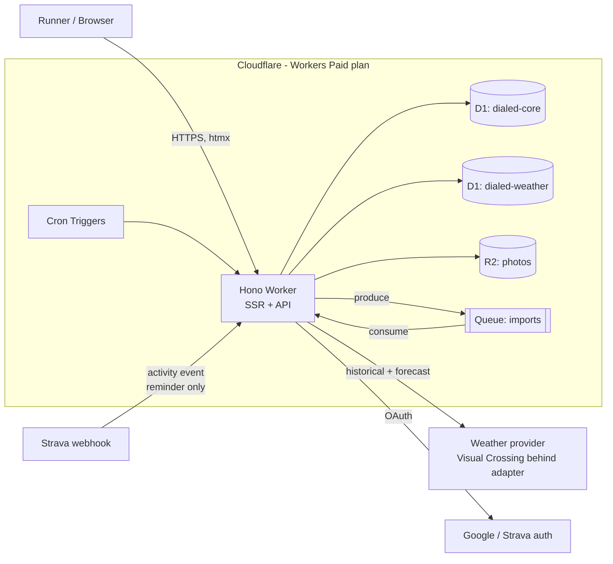
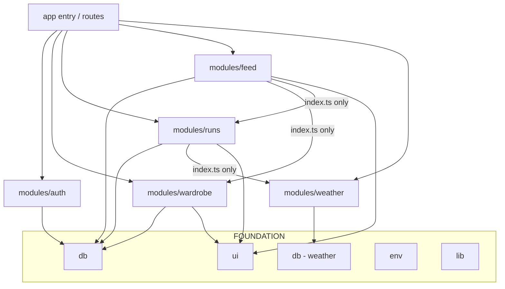
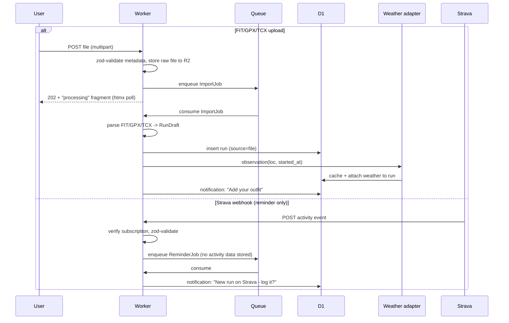
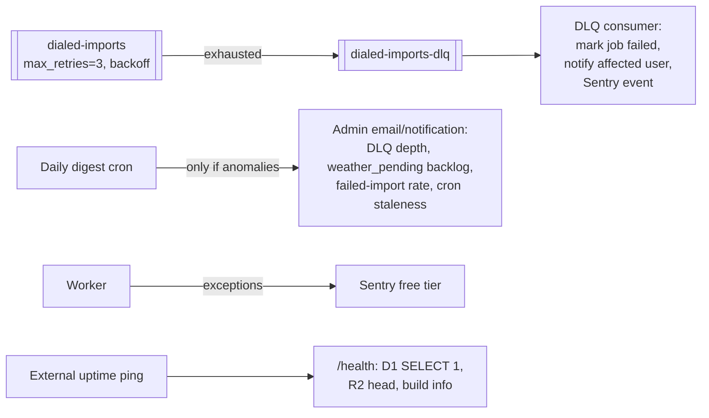

# Dialed — Architecture

One Worker, SSR-first, everything on the Cloudflare $5 plan. This document is
the shared map: humans review against it, agents build against it. **If your
change alters a boundary shown here, update the diagram in the same PR.**

## System context

Key decisions embedded here:

- **Strava data never enters the feed or the recommender.** The webhook is a
  reminder trigger only; run records are first-party (manual or file import).
- **Two D1 databases**: `dialed-core` (users, wardrobe, runs, feed) and
  `dialed-weather` (observations cache). Weather grows unbounded; isolating
  it protects the core DB from the 10 GB per-database cap.
- **Weather is an adapter** (`modules/weather/provider/`). Visual Crossing is
  the first implementation; swapping providers is a one-directory change.

## Module dependency graph (enforced by dependency-cruiser)

Rules: modules import foundation freely; cross-module imports go through the
target module's `index.ts`; only `env/` reads bindings; `routes/` is imported
only by the app entry; no cycles.

## Import pipeline (lane 102)

## Feed read path (lane 104)

Fanout-on-read. One indexed query:
`outfit_entries` joined to `follows` on author, ordered by `created_at DESC`,
cursor-paginated. Covering indexes: `follows(follower_id, followee_id)` and
`outfit_entries(user_id, created_at DESC)`. No feed table, no write
amplification. Photos render from R2 via cached public bucket URLs.

## Rungs of verification

| Rung                       | Runs                          | Tools                                                                  |
| -------------------------- | ----------------------------- | ---------------------------------------------------------------------- |
| Stop gate (per agent turn) | diff-scoped                   | eslint, tsc                                                            |
| Commit gate                | merge-base diff + whole graph | + knip, dependency-cruiser                                             |
| CI (authoritative)         | whole repo                    | + vitest (workers pool), Playwright smoke, `wrangler deploy --dry-run` |

## Runtime resilience & solo-ops posture

Design target: **weeks of unattended operation**; the system reports by
exception, the human never polls dashboards.

- **Queues**: `max_retries: 3` with delayed retry; DLQ bound and consumed —
  a dead-lettered job becomes a user-visible failure + Sentry event, never
  silence.
- **Alerting is exception-based**: the daily digest cron emails/notifies
  **only when** thresholds trip (DLQ > 0, weather_pending > N for > 24h, any
  cron that hasn't checkpointed on schedule). A quiet inbox means healthy.
- **Uptime**: free external ping (e.g. UptimeRobot) against `/health`.
- **Backups**: D1 Time Travel gives 30-day point-in-time restore with zero
  setup — the recovery story is "restore to timestamp", documented in
  workflow.md. R2 originals are the photo source of truth; derived sizes are
  regenerable.
- **Deploys**: CI applies migrations (expand→contract only) before deploy;
  Wrangler gradual deployments + one-command rollback. A bad deploy is a
  rollback, not an incident.
- **Abuse without moderators**: Turnstile on signup, Cloudflare WAF rate
  limits on auth + upload endpoints, hard size/type caps on all uploads.
  These are free and remove the whole class of 3am problems.

## Launch gate vs post-MVP

**Launch gate** (must merge before public sign-ups): Task 105 trust & safety
floor — photo screening via Workers AI, report→hide→review, link hygiene,
ban mechanics — plus the dashboard-side CSAM scanning tool. MVP lanes
101–104 can land and be dogfooded privately without it.

**Post-MVP** (documented so agents don't build toward the wrong future):
affiliate link engine, Pick-My-Outfit recommender (first-party data only),
body measurements, Polar/Fitbit adapters behind `RunSource`, Garmin API if
the program reopens, iOS app (unlocks Apple Health). None of these justify
speculative abstraction now — `RunSource` and `WeatherProvider` are the only
two seams built ahead of need, deliberately.
